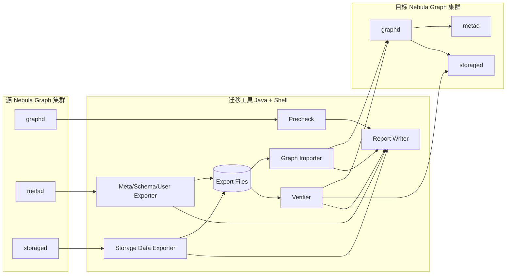
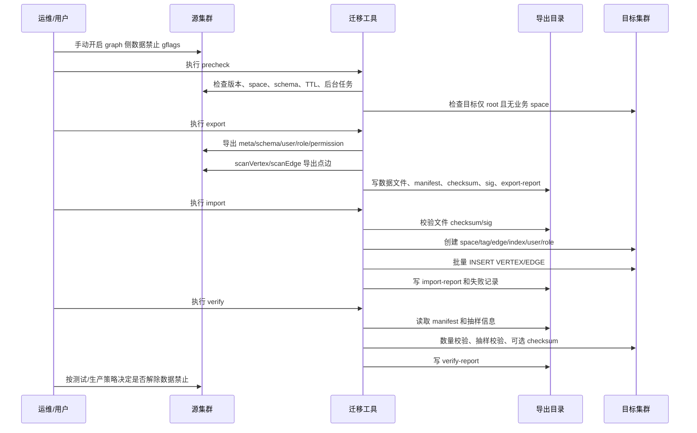
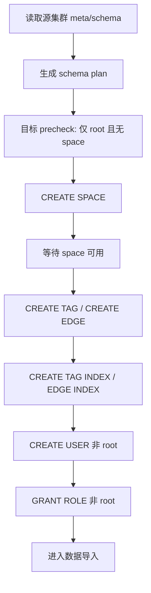
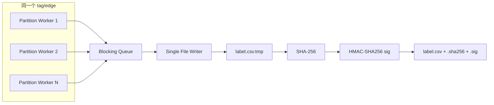
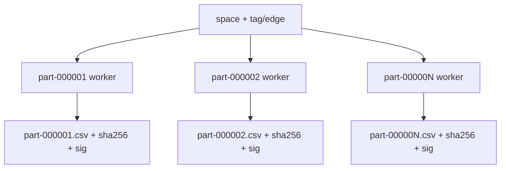
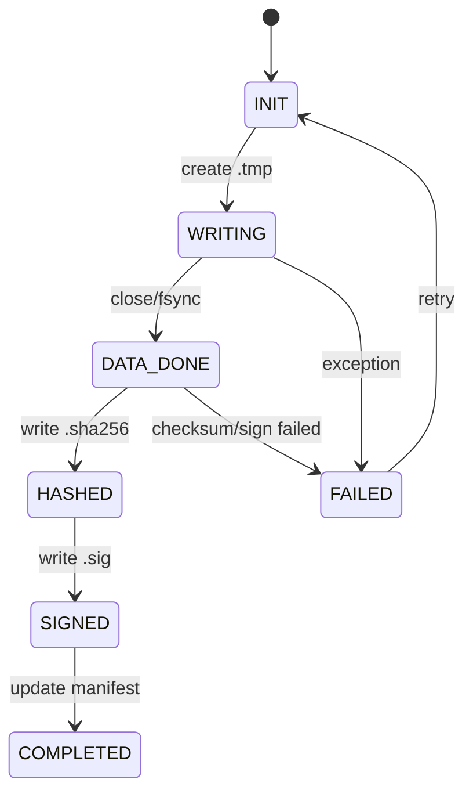
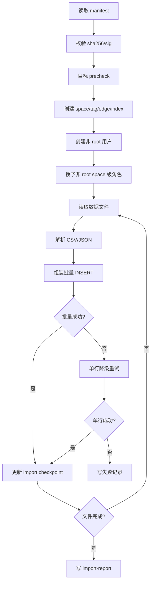

# Nebula Graph 跨集群全量搬迁设计方案

## 1. 目标

本文设计一个面向生产环境的 Nebula Graph 跨集群全量搬迁工具。工具使用 Java 和 Shell 实现，依赖限定为 nebula-java，不使用 Spark、Flink、Nebula Importer 等其他组件。

核心链路：

1. 从源集群导出 meta/schema/user/role/permission 信息。
2. 使用 nebula-java `StorageClient.scanVertex/scanEdge` 直连源集群 storage 导出点边数据。
3. 将导出数据保存为 CSV 或 JSON 文件，并生成 manifest、checksum、签名和报告。
4. 使用 nebula-java 连接目标 graph service，执行 schema/user/permission 重建和 `INSERT VERTEX/EDGE` 数据导入。
5. 迁移完成后执行数量一致、抽样一致校验，按需执行全量 checksum 校验。

## 2. 非目标

本方案不覆盖：

1. 增量迁移、实时同步、双写、CDC。
2. 跨版本迁移。
3. 物理快照、RocksDB 文件复制、WAL 复制。
4. Spark、Flink、Nebula Importer 等外部导入链路。
5. job 运行信息、全文索引、配置参数、快照文件、日志文件搬迁。
6. storage host 地址、leader、raft membership 等物理运行状态搬迁。
7. root 密码、root 权限变更。
8. `segment` 文件布局代码实现。本期仅在设计文档中描述，不进入开发。

## 3. 术语

| 术语 | 含义 |
| --- | --- |
| 源集群 | 被搬迁的 Nebula Graph 集群 |
| 目标集群 | 接收数据的 Nebula Graph 集群 |
| 数据静止 | 源集群禁止写入和后台数据变更，形成导出边界 |
| label 布局 | 一个 tag/edge 一个导出文件 |
| partition 布局 | 一个 tag/edge 按 partition 拆分文件 |
| manifest | 导出任务的结构化清单、文件状态和校验元数据 |
| canonical 编码 | 用于 checksum 的稳定 typed value 编码 |
| 默认校验 | 数量一致 + 抽样一致 |
| 全量 checksum | 手动开启的增强校验 |

## 4. 总体架构



### 4.1 模块划分

| 模块 | 职责 |
| --- | --- |
| Shell Launcher | 启动导出、导入、校验任务，加载配置，设置 JVM 参数 |
| Config Loader | 读取 Java `.properties` 配置 |
| Cluster Connector | 管理 graph/meta/storage 连接 |
| Precheck | 检查源/目标集群状态、版本、目标空集群、后台任务风险 |
| Metadata Exporter | 导出 space、tag、edge、index、user、role、permission |
| Storage Exporter | 按 label 或 partition 导出 vertex/edge 数据 |
| File Writer | 写 CSV/JSON、临时文件、checksum、签名 |
| Manifest Manager | 维护 manifest、checkpoint、任务状态 |
| Graph Importer | 重建 schema/user/permission，执行 `INSERT VERTEX/EDGE` |
| Retry Manager | 管理导入批量重试、单行降级重试、失败记录 |
| Verify Engine | 数量校验、抽样校验、可选全量 checksum |
| Report Writer | 输出 export/import/verify 报告 |

### 4.2 关键 API 依据

本设计依赖当前 nebula-java 和 Nebula Graph storage 读路径能力：

1. nebula-java `StorageClient` 支持按 `space + tag/edge + partition + limit` 执行 `scanVertex/scanEdge`。
2. nebula-java graph `Session.execute` 支持执行任意 nGQL，用于 schema/user/role 创建和 `INSERT VERTEX/EDGE` 导入。
3. Nebula Graph storage scan 路径会执行 TTL 判断，TTL 已过期数据对 `scanVertex/scanEdge` 不可见。
4. nebula-java 高层 `MetaClient` 当前只封装了部分 meta API；设计实现时可结合 graph nGQL 和 generated MetaService thrift API 完成 index/user/role/permission 读取。

## 5. 迁移主流程



## 6. 数据静止设计

### 6.1 数据静止边界

测试阶段：

1. 验证目标集群与当前源集群一致。
2. 源集群冻结覆盖导出、导入、校验全过程。

生产阶段：

1. 验证目标集群与导出快照一致。
2. 导出完成时刻即为快照边界。

### 6.2 冻结控制

数据禁止由用户手动通过 graph 侧 gflags 控制。工具不负责打开或关闭该 gflags，但 precheck 需要输出明确检查提示。

冻结成功语义：

1. 所有 graphd 和 storaged 已进入只读状态。
2. 已进入 graphd/storaged 的写请求等待完成。
3. 冻结成功后新写请求被拒绝。
4. 涉及后台数据变更的任务需要禁止或确认无运行中任务。

迁移期间需要禁止或确认无运行中的任务：

1. DML：`INSERT`、`UPDATE`、`UPSERT`、`DELETE`。
2. DDL：`CREATE/ALTER/DROP SPACE`、`CREATE/ALTER/DROP TAG`、`CREATE/ALTER/DROP EDGE`、`CREATE/DROP INDEX`。
3. 后台任务：`BALANCE`、`BALANCE LEADER`、`COMPACT`、`DOWNLOAD/INGEST`、`REBUILD INDEX`。

## 7. Precheck

### 7.1 源集群检查

| 检查项 | 处理 |
| --- | --- |
| Nebula 版本 | 必须为 3.8 |
| space 列表 | 必须可读取 |
| schema 列表 | 必须可读取 |
| storage hosts | 必须可读取且在线 |
| partition 分布 | 必须可读取 |
| TTL schema | 打印 warning，写入 manifest/report，不阻断 |
| 后台 job | 如存在 RUNNING/QUEUE 的数据变更任务，报错或提示用户处理 |
| graph 数据禁止 | 输出检查项，要求用户确认已开启 |

### 7.2 目标集群检查

| 检查项 | 处理 |
| --- | --- |
| Nebula 版本 | 必须为 3.8 |
| space | 必须无业务 space |
| 用户 | 只能存在 `root` |
| graph 可连接性 | 必须可执行 nGQL |
| storage/meta 可连接性 | 校验阶段需要可连接 |

目标集群不满足要求时，导入脚本退出。工具不自动执行 `DROP SPACE` 或 `DROP USER`。

## 8. 元数据搬迁设计

### 8.1 搬迁对象

| 对象 | 来源 | 目标动作 |
| --- | --- | --- |
| Space | meta 或 graph nGQL | `CREATE SPACE` |
| Tag schema | meta 或 graph nGQL | `CREATE TAG` |
| Edge schema | meta 或 graph nGQL | `CREATE EDGE` |
| Native tag index | meta 或 graph nGQL | `CREATE TAG INDEX` |
| Native edge index | meta 或 graph nGQL | `CREATE EDGE INDEX` |
| 非 root 用户 | graph/meta | `CREATE USER`，默认密码 `nebula` |
| root 用户 | graph/meta | 只写报告，不导入、不修改 |
| 非 root space 级角色 | graph/meta | `GRANT ROLE ... ON <space>` |
| 商业版扩展权限 | graph/meta 能力允许时读取 | 无法完整导出时 warning + report |

### 8.2 Schema 重建顺序



要求：

1. 先建 index 再导入数据。
2. schema/index 创建失败时导入脚本退出。
3. 用户手动清理目标集群后重新执行。
4. 本期不支持 schema/index 阶段复杂断点续导。

## 9. 数据导出设计

### 9.1 导出对象

Vertex：

1. 按 space、tag 导出。
2. 每个 tag 独立导出文件。
3. 同一个 vertex 多 tag 时，会在多个 tag 文件中分别出现。

Edge：

1. 按 space、edge type 导出。
2. 每个 edge type 独立导出文件。
3. 导出字段包含 `_src`、`_dst`、`_rank` 和属性列。

### 9.2 Storage scan

使用 nebula-java `StorageClient`：

1. `scanVertex(spaceName, part, tagName, returnCols, limit)`
2. `scanEdge(spaceName, part, edgeName, returnCols, limit)`

默认参数：

```text
export.scan.limit = 1000
export.concurrent.partitions = 8
export.concurrent.labels = 1
```

本期设置：

1. `allowPartSuccess=false`，避免部分成功被误认为完整导出。
2. `allowReadFromFollower=false`，优先读 leader，降低一致性歧义。

### 9.3 label 布局



特点：

1. 一个 tag/edge 一个大文件。
2. 多 partition 并发 scan。
3. 单 writer 串行写同一个文件。
4. 文件行顺序不作为一致性标准。
5. checkpoint 粒度为 tag/edge 文件级。
6. 文件无签名时整体重导。

目录示例：

```text
data/<space>/vertices/<tag>.csv
data/<space>/vertices/<tag>.csv.sha256
data/<space>/vertices/<tag>.csv.sig
data/<space>/edges/<edge>.csv
data/<space>/edges/<edge>.csv.sha256
data/<space>/edges/<edge>.csv.sig
```

### 9.4 partition 布局



特点：

1. 每个 `space + tag/edge + partition` 一个文件。
2. 每个 partition 文件独立生成 `.sha256` 和 `.sig`。
3. 恢复时已签名 partition 文件跳过。
4. 未签名 partition 文件整体重导。

目录示例：

```text
data/<space>/vertices/<tag>/part-000001.csv
data/<space>/vertices/<tag>/part-000001.csv.sha256
data/<space>/vertices/<tag>/part-000001.csv.sig
data/<space>/edges/<edge>/part-000001.csv
data/<space>/edges/<edge>/part-000001.csv.sha256
data/<space>/edges/<edge>/part-000001.csv.sig
```

### 9.5 segment 布局

`segment` 布局仅进入设计文档，不进入本期代码开发。

未来扩展：

```text
data/<space>/vertices/<tag>/part-000001/segment-000000.csv
data/<space>/edges/<edge>/part-000001/segment-000000.csv
```

用途：

1. 超大 partition 拆分。
2. 更细粒度断点续导。
3. 更细粒度导入重试。

## 10. 文件格式设计

### 10.1 CSV

CSV 规则：

1. RFC4180 风格。
2. `NULL` 使用 `\N`。
3. 空字符串使用 `""`。
4. 逗号、双引号、换行字段使用双引号包裹。
5. 字段内双引号写作两个双引号。
6. 列类型、列顺序、VID 类型写入 schema metadata。

Vertex CSV：

```text
_vid,prop1,prop2,prop3
"player100","Tim Duncan",42,\N
```

Edge CSV：

```text
_src,_dst,_rank,prop1,prop2
"player100","team204",0,"Spurs",1997
```

### 10.2 JSON

JSON 使用 JSON Lines，每行一个 typed JSON 对象，避免超大 JSON 数组。

Vertex JSON：

```json
{"vid":{"type":"string","value":"player100"},"props":{"name":{"type":"string","value":"Tim Duncan"},"age":{"type":"int","value":42},"memo":{"type":"null","value":null}}}
```

Edge JSON：

```json
{"src":{"type":"string","value":"player100"},"dst":{"type":"string","value":"team204"},"rank":{"type":"int","value":0},"props":{"teamName":{"type":"string","value":"Spurs"},"startYear":{"type":"int","value":1997}}}
```

### 10.3 canonical 编码

canonical 编码用于 full checksum，不要求和 CSV/JSON 文本一致。

要求：

1. 保留 Nebula typed value 语义。
2. 稳定区分 `NULL`、空字符串和普通字符串。
3. 稳定编码整数、浮点、布尔、日期时间、VID、字符串转义。
4. row hash 包含 key、label、schema version 或 schema hash、属性名、属性类型、属性值。

## 11. checksum、签名和文件完成语义

### 11.1 算法

1. checksum：`SHA-256(data file bytes)`。
2. signature：`HMAC-SHA256(defaultKey, sha256 + file metadata)`。
3. HMAC 使用固定内置默认密钥。
4. 默认 HMAC 不作为安全防篡改承诺，只作为完成标记。

### 11.2 文件完成流程



完成判定：

1. 正式数据文件存在。
2. `.sha256` 存在且校验通过。
3. `.sig` 存在且校验通过。
4. manifest 中该文件状态为 `COMPLETED`。

## 12. manifest 与报告

### 12.1 manifest

`manifest.json` 是任务恢复和审计入口。

核心字段：

```json
{
  "jobId": "migration-20260708-001",
  "sourceCluster": {"version": "3.8"},
  "targetCluster": {"version": "3.8"},
  "format": "csv",
  "layout": "label",
  "spaces": [],
  "schemas": [],
  "users": [],
  "files": [],
  "ttlWarnings": [],
  "createdAt": "...",
  "updatedAt": "..."
}
```

文件项字段：

```json
{
  "space": "basketballplayer",
  "kind": "vertex",
  "label": "player",
  "partition": 1,
  "path": "data/basketballplayer/vertices/player/part-000001.csv",
  "rowCount": 1000,
  "byteSize": 123456,
  "sha256": "...",
  "signature": "...",
  "status": "COMPLETED"
}
```

### 12.2 报告

固定输出：

```text
manifest.json
export-report.json
import-report.json
verify-report.json
```

报告要求：

1. 记录任务开始、结束、耗时、状态。
2. 记录每个 space/tag/edge/partition 的行数。
3. 记录 TTL warning。
4. 记录 root 用户审计信息。
5. 记录未迁移的商业版扩展权限。
6. 未开启全量 checksum 时，明确标记“未证明全量完全一致”。

## 13. 导入设计

### 13.1 导入流程



### 13.2 默认参数

```text
import.batch.vertices = 500
import.batch.edges = 500
import.retry.max-attempts = 3
import.retry.backoff.ms = 1000
```

### 13.3 失败记录

单行失败记录包含：

1. 原始文件路径。
2. 行号。
3. vertex/edge key。
4. 原始行文本。
5. 生成的 nGQL。
6. 错误码。
7. 错误消息。
8. 重试次数。

### 13.4 幂等语义

1. 重复导入同一份导出文件时，允许同 key 同值覆盖。
2. 依赖目标空集群规避同 key 不同值冲突。
3. 导入中断后恢复时，已成功写入的数据再次执行 `INSERT` 可以接受。

## 14. 校验设计

### 14.1 默认校验

默认成功条件：

1. 数量一致。
2. 抽样一致。

数量校验：

1. 导出阶段按 space/tag/edge/partition 统计行数。
2. 导入后扫描目标集群，按相同维度统计。
3. 对比 manifest/export-report 与目标统计。

抽样校验：

1. 使用 deterministic sampling。
2. 以 vertex key 或 edge key hash 决定是否抽样。
3. 抽样结果写入 manifest 或 sample 文件。
4. 校验时从目标集群读取对应 key，按 typed value 语义比较。

### 14.2 全量 checksum

全量 checksum 手动开启。

设计：

1. 导出阶段按 space/tag/edge/partition 计算 canonical row checksum。
2. 校验阶段扫描目标集群并计算同样 checksum。
3. 对比 checksum、row count。
4. 未开启时报告中标记“未证明全量完全一致”。

## 15. TTL 处理

源码分析结论：

1. TTL 不是仅在 auto compaction 阶段生效。
2. storage 读路径会判断 TTL，过期数据对 query 和 scan 不可见。
3. compaction filter 负责物理清理过期数据。
4. `StorageClient.scanVertex/scanEdge` 对应 storage scan 路径会过滤 TTL 已过期数据。

工具处理策略：

1. 导出阶段识别到 schema 存在 TTL 时，log4j 打 warning。
2. TTL 标记写入 `manifest.json` 和 `export-report.json`。
3. 存在 TTL 不阻断导出。
4. 校验策略不因 TTL 改变。

风险说明：

1. 数据静止不等于时间静止。
2. TTL 数据可能在导出、导入、校验期间因时间推进而过期。
3. 测试阶段如验证“目标与当前源一致”，TTL 测试数据应保证过期时间覆盖完整迁移窗口。

## 16. 断点续导与续导入

### 16.1 导出恢复

label 布局：

1. 已签名 tag/edge 文件跳过。
2. 未签名 tag/edge 文件整体重导。

partition 布局：

1. 已签名 partition 文件跳过。
2. 未签名 partition 文件整体重导。

### 16.2 导入恢复

导入 checkpoint 记录：

1. 当前文件。
2. 当前行号或 byte offset。
3. 已完成文件列表。
4. 失败记录位置。

恢复策略：

1. 已完成文件跳过。
2. 未完成文件从 checkpoint 继续。
3. 如 checkpoint 落后于实际写入，重复 `INSERT` 依赖幂等语义处理。

## 17. 配置设计

配置文件使用 Java `.properties`。

示例：

```properties
source.meta.addresses=10.0.0.1:9559,10.0.0.2:9559,10.0.0.3:9559
source.graph.addresses=10.0.0.1:9669,10.0.0.2:9669,10.0.0.3:9669
source.user=root
source.password=nebula

target.graph.addresses=10.1.0.1:9669,10.1.0.2:9669,10.1.0.3:9669
target.meta.addresses=10.1.0.1:9559,10.1.0.2:9559,10.1.0.3:9559
target.user=root
target.password=nebula

export.dir=/data/nebula-migration/job-001
export.format=csv
export.file.layout=label
export.scan.limit=1000
export.concurrent.partitions=8
export.concurrent.labels=1

import.batch.vertices=500
import.batch.edges=500
import.retry.max-attempts=3
import.retry.backoff.ms=1000

verify.full-checksum.enabled=false
verify.sample.mod=100000
```

## 18. 命令设计

Shell 命令：

```bash
bin/migration-precheck.sh -c migration.properties
bin/migration-export.sh -c migration.properties
bin/migration-import.sh -c migration.properties
bin/migration-verify.sh -c migration.properties
bin/migration-retry-failed.sh -c migration.properties
```

Java 入口：

```text
java -jar nebula-migration.jar precheck -c migration.properties
java -jar nebula-migration.jar export -c migration.properties
java -jar nebula-migration.jar import -c migration.properties
java -jar nebula-migration.jar verify -c migration.properties
java -jar nebula-migration.jar retry-failed -c migration.properties
```

## 19. 目录结构

label 布局：

```text
job-001/
  manifest.json
  export-report.json
  import-report.json
  verify-report.json
  meta/
    schema.json
    users.json
    roles.json
  data/
    basketballplayer/
      vertices/
        player.csv
        player.csv.sha256
        player.csv.sig
      edges/
        follow.csv
        follow.csv.sha256
        follow.csv.sig
  failures/
    import-failed.csv
  logs/
```

partition 布局：

```text
job-001/
  data/
    basketballplayer/
      vertices/
        player/
          part-000001.csv
          part-000001.csv.sha256
          part-000001.csv.sig
      edges/
        follow/
          part-000001.csv
          part-000001.csv.sha256
          part-000001.csv.sig
```

## 20. 测试方案

### 20.1 单元测试

1. CSV 编码/解码。
2. JSON typed 编码/解码。
3. canonical checksum。
4. SHA-256 和 HMAC-SHA256。
5. manifest 状态流转。
6. nGQL 生成和转义。
7. 失败记录格式。

### 20.2 集成测试

1. 空目标集群 precheck。
2. 目标已有 space 失败。
3. 目标已有非 root 用户失败。
4. schema/index 创建。
5. 非 root 用户和 space 级角色授权迁移。
6. label 布局导出、恢复、导入。
7. partition 布局导出、恢复、导入。
8. CSV 和 JSON 两种格式。
9. 字符串 VID 和整数 VID。
10. 多 space、多 tag、多 edge。
11. TTL schema warning 和报告标记。
12. 批量导入失败后单行降级重试。
13. 导入失败记录重试。
14. 默认校验和全量 checksum 校验。

### 20.3 故障注入测试

1. 导出过程中 kill 进程。
2. 导入过程中 kill 进程。
3. 删除 `.sig` 后恢复导出。
4. 修改数据文件触发 checksum 失败。
5. schema 创建中途失败。
6. graph/storage 连接短暂失败。
7. 单批 INSERT 失败。

### 20.4 性能测试

1. 使用开源数据集验证 5000 万左右点边规模。
2. 如开源数据集不覆盖多 space、多 tag、多 edge、索引、TTL、权限、VID 类型和复杂数据类型，则构造补充数据集。
3. 测试 label 和 partition 两种布局。
4. 记录导出速度、导入速度、CPU、内存、磁盘、网络、失败恢复耗时。

## 21. 风险与约束

| 风险 | 影响 | 缓解 |
| --- | --- | --- |
| label 单文件过大 | 失败后整体重导成本高 | 提供 partition 布局 |
| 默认 HMAC 固定密钥 | 不具备强安全防篡改能力 | 文档明确说明，checksum 负责完整性 |
| TTL 随时间过期 | 测试阶段源/目标当前状态可能变化 | TTL warning，测试数据保证迁移窗口内不过期 |
| schema/index 失败 | 目标集群可能半初始化 | 脚本退出，用户手动清理后重试 |
| 目标非空 | 可能覆盖数据 | precheck 阻断 |
| 批量 INSERT 失败 | 导入中断或丢数据 | 降级单行重试，失败落盘 |
| 商业版扩展权限不可完整导出 | 权限不完全一致 | warning + report |

## 22. 结论

本方案满足一次性全量跨集群搬迁需求。默认采用 CSV + label 布局，支持 JSON 和 partition 布局；通过 manifest、checksum、签名、checkpoint 和失败记录支持可审计、可恢复的导出导入流程。默认校验为数量一致和抽样一致，全量 checksum 作为手动增强能力。

本方案设计完成后，可进入代码开发阶段，建议优先实现：

1. 配置、日志、manifest、报告基础设施。
2. meta/schema/user/role 导出。
3. label 布局 CSV 导出。
4. 目标 precheck 和 schema/index 导入。
5. vertex/edge 批量导入与失败重试。
6. 默认数量校验和抽样校验。
7. partition 布局和 JSON 支持。
