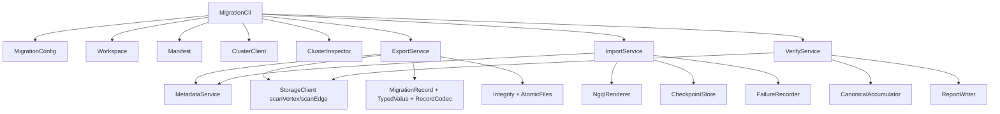

# Nebula Graph 跨集群搬迁代码详细解读

## 1. 代码位置与阅读入口

迁移工具代码不在当前文档仓库，而在：

```text
/home/sch/nebula/nebula-tools/nebula-migration
```

Maven 坐标为 `com.vesoft.nebula:nebula-migration:0.1.0`。入口类为 `com.vesoft.nebula.migration.MigrationCli`，构建产物是一个包含依赖的可执行 JAR。代码以 Java 8 编写，直接使用 nebula-java `3.8.4`：源端通过 `StorageClient` 扫描，目标端通过 `NebulaPool`/`Session` 执行 nGQL。

本文聚焦数据搬迁实现。源端一致性控制相关代码不在本文设计范围内，后续重构时应将其从当前主链路中拆出，并为其单独建立行为契约和测试。

## 2. 总体调用关系



运行时状态保存在 `Workspace` 下；`Manifest` 描述任务和 artifact，`CheckpointStore` 记录导入进度，`FailureRecorder` 记录无法写入的单行数据。这三者共同决定任务能否恢复，不依赖内存状态。

## 3. 类与职责映射

| 类 | 职责 | 关键实现点 |
| --- | --- | --- |
| `MigrationCli` | CLI 编排、日志初始化、命令分派 | 只接受 `<command> -c <properties>`，把异常映射为稳定退出码 |
| `MigrationConfig` | 加载并校验 `.properties` | 解析 graph/meta 地址、格式、布局、并发、校验和重试参数 |
| `Workspace` | 创建任务目录并加文件锁 | 防止多个进程同时修改同一 manifest/checkpoint |
| `Manifest` | 任务状态机与 artifact 清单 | `NEW -> PRECHECKED -> EXPORTING -> EXPORTED -> IMPORTING -> IMPORTED -> VERIFYING -> VERIFIED`；失败状态为 `FAILED` |
| `ClusterClient` | graph pool、StorageClient、nGQL 封装 | graph pool 最大 16 个 session；StorageClient 通过 meta 地址发现 storage |
| `ClusterInspector` | 集群版本、host、space、label、partition、目标空集群检查 | 通过 nGQL 读取 `SHOW` 结果；Storage 版本 API 不可用时只证明 ONLINE |
| `MetadataService` | metadata 导出与重建 | `SHOW CREATE`、用户/角色、TTL 标记、schema 可见性等待 |
| `ExportService` | 分区并发扫描、文件生成、导出恢复 | vertex 与 edge 分别扫描；edge 采用独占 StorageClient 池 |
| `RecordCodec` | CSV/JSON Lines 编解码 | 用 typed/Base64 编码避免分隔符、空字符串和特殊字符歧义 |
| `TypedValue` | 值类型保真与 nGQL literal 渲染 | 处理 NULL、bool、数值、字符串、日期时间、geography、duration |
| `NgqlRenderer` | 批量 `INSERT` 字符串生成 | 同一 batch 必须有相同属性列，生成多值 vertex 或 edge INSERT |
| `Integrity` | SHA-256、HMAC 完成标记、侧车验证 | 签名含文件统计，支持导出恢复 |
| `ImportService` | metadata/data 导入、重试、失败降级 | batch 失败后逐行重试；持久 checkpoint 和失败队列 |
| `VerifyService` | 目标扫描、数量/样本/全量摘要校验 | 输出 artifact 和 partition 级明细 |
| `CanonicalAccumulator` | 顺序无关的全量摘要 | 256 位 SHA-256 的 XOR 与模和组合 |

## 4. 启动、配置和状态机

### 4.1 `MigrationCli`

`MigrationCli.main` 调用 `run` 并用 `System.exit` 返回枚举 `ExitCode` 的数值。每个命令执行前依次完成：

1. `MigrationConfig.load` 读取 properties 并验证取值。
2. `Workspace.open` 创建 `data`、`meta`、`reports`、`failures`，并持有 `.workspace.lock`。
3. `Manifest.load` 读取已有状态；若不存在则创建 `NEW` manifest 和任务 ID。
4. `configureLogging` 把 log4j 输出定向到 `<workspace>/logs/<command>.log`。
5. 根据命令调用 `ClusterInspector`、`ExportService`、`ImportService` 或 `VerifyService`。

`MigrationException` 携带业务退出码，普通异常则映射为 `10`。这使 Shell 调度器可按退出码区分参数、前置、导出、导入、元数据或校验失败。

### 4.2 `MigrationConfig`

`MigrationConfig` 的配置验证具有两个重要约束：

- `export.format` 只能是 `csv` 或 `json`，`export.file.layout` 只能是 `label` 或 `partition`。
- `import.artifact.concurrency` 不得超过 16，因为 `ClusterClient` 内的 NebulaPool 也设置为最大 16 个连接。

相对 workspace 路径相对于 properties 文件所在目录解析。这让同一个配置及其导出目录可以整体迁移到另一台执行主机。

## 5. 连接层：`ClusterClient`

`ClusterClient.connect` 同时建立两类客户端：

| 连接 | 初始化参数 | 用途 |
| --- | --- | --- |
| `NebulaPool` | `source/target.graph.addresses`，最大 16 连接 | nGQL、元数据导出、目标导入、版本和对象检查 |
| `StorageClient` | `source/target.meta.addresses`，附带账号密码 | 源端导出和目标校验的 `scanVertex/scanEdge` |

`execute(Session, nGQL, ExitCode)` 是所有 nGQL 调用的统一包装：nGQL 执行失败时，它把服务端 error code、error message 和语句文本组合进 `MigrationException`。`identifier` 对反引号转义，`TypedValue` 则处理 literal 层面的值转义。

`executeInSpaceOnGraph` 建立只连接某一个 graphd 的临时 pool。`MetadataService` 用它对每个 graphd 做 schema cache 可见性检查，避免负载均衡会掩盖某个 graphd 未刷新 schema 的情况。

## 6. 元数据导出与导入：`MetadataService`

### 6.1 导出顺序

`exportMetadata` 的逻辑如下：

```text
SHOW SPACES
  -> SHOW CREATE SPACE
  -> USE <space>
  -> SHOW CREATE TAG / EDGE
  -> SHOW CREATE TAG INDEX / EDGE INDEX
  -> SHOW USERS
  -> SHOW ROLES IN <space>
```

生成两份文件：

- `meta/metadata.statements`：每个 DDL/权限语句一行 Base64，机器重放用。
- `meta/metadata.nql`：人可读审计文件，标明 root 只审计、扩展权限不导出和排除对象。

用户和角色策略直接体现在 `exportUsersAndRoles`：root 仅写 audit，其他用户生成 `CREATE USER ... WITH PASSWORD "nebula"`；仅生成非 root 的 `GRANT ROLE <role> ON <space> TO <user>`。

`hasActiveTtl` 从 `SHOW CREATE TAG/EDGE` 的 `ttl_duration` 中识别正数 TTL。检测到后不终止导出，而是在 manifest 与 export report 中标记并写 warning。

### 6.2 导入顺序与 schema 可见性

`importMetadata` 分两轮执行语句：先完成全部 `CREATE SPACE`，再执行 `USE`、tag、edge、index、用户和角色。这避免新建 space 的 meta 同步尚未完成时紧接着创建 schema。

之后 `waitForSchemaVisibility` 解析 metadata 语句中的 `USE` 与 `CREATE TAG/EDGE`，在每个目标 graphd 上执行不写数据的 `EXPLAIN INSERT`。只有所有 graphd 都能解析相应 schema 后才允许数据导入。DDL 发生不可重试的失败时，错误消息要求人工清理目标，因为工具不会猜测哪些已创建对象应被删除。

## 7. 数据模型与文件编码

### 7.1 `MigrationRecord`

一个 `MigrationRecord` 对应一条 vertex 或 edge：

| 字段 | vertex | edge |
| --- | --- | --- |
| `kind` | `VERTEX` | `EDGE` |
| `firstKey` | VID | `_src` |
| `secondKey` | 无 | `_dst` |
| `rank` | `0` | edge rank |
| `properties` | tag 属性 | edge 属性 |

构造函数将属性放入 `TreeMap` 后再保存为有序 `LinkedHashMap`。因此属性名顺序不会受 Storage 返回 map 的遍历顺序影响；同一逻辑也用于 nGQL batch 和 checksum。

### 7.2 `TypedValue`

`TypedValue` 将 Nebula `ValueWrapper` 显式编码为 `类型代码:Base64(UTF-8 内容)`。支持类型如下：

| 类型代码 | 值类型 | nGQL 渲染 |
| --- | --- | --- |
| `N` | NULL | `NULL` |
| `B` | BOOLEAN | `true` / `false` |
| `I` | INTEGER | 十进制数值 |
| `F` | DOUBLE | Java `Double.toString` 数值 |
| `S` | STRING | 带转义双引号字符串 |
| `D` | DATE | `date("...")` |
| `T` | TIME | `time("...")` |
| `DT` | DATETIME | `datetime("...")` |
| `G` | GEOGRAPHY | `ST_GeogFromText("...")` |
| `DU` | DURATION | `duration({months,seconds,microseconds})` |

NaN 和正负无穷大在导出阶段被拒绝，因为它们无法稳定渲染为 nGQL literal。duration 保存 nebula-java wrapper 的 wire 字段，而非展示字符串，以避免微秒精度被格式化过程改变。

### 7.3 `RecordCodec`

CSV 固定头为：

```text
kind,key1,key2,rank,properties
```

`properties` 内部使用 `Base64URL(property-name):TypedValue`，多个属性使用分号连接。JSON 格式也是 JSON Lines，每行保存同一组字段，`key1`、`key2` 和 `properties` 都使用 typed 编码。两种格式均不是面向人工编辑的通用业务 CSV/JSON，而是可审计、可恢复、保留类型语义的迁移编码。

## 8. 导出实现：`ExportService`

### 8.1 调度粒度

`ExportService.export` 先调用 `MetadataService.exportMetadata`，随后按 space 顺序执行 vertex 再 edge。对于每个种类：

1. `ClusterInspector.labels` 获取 tag 或 edge type。
2. `ClusterInspector.partitions` 获取 space partition ID。
3. `export.label.concurrency` 控制多个 label 的并行度。
4. `export.partition.concurrency` 控制一个 label 内 partition 的并行度。
5. 每个 `PartExportTask` 使用 `StorageClient.scanVertex` 或 `scanEdge` 翻页，直到 iterator 结束。

scan 返回任何 `isAllSuccess=false` 会立即视为导出失败，避免将部分成功页当成完整 artifact。

### 8.2 vertex 与 edge 客户端策略

vertex partition 共用源端默认 `StorageClient`。edge partition 则由 `EdgeScanClientPool` 为每个在飞任务租用独占 `StorageClient`，生命周期覆盖整个分页过程。注释说明 nebula-java 3.8 edge iterator 在翻页时会改变连接池状态，若多个 edge iterator 共享同一 client，可能损坏 Thrift 流；独占 client 避免该并发风险。

### 8.3 两种文件布局

| 布局 | 写入过程 | 完成粒度 | 恢复行为 |
| --- | --- | --- | --- |
| `label` | 每个 partition 先写 `.staging`，最后按 partition ID 合并 | tag/edge 整体 | 签名缺失或无效时重导整个 label |
| `partition` | 每个 partition 直接写最终文件 | 单 partition | 已签名的 partition 跳过，其余单独重导 |

所有写入先落到 `.tmp`，调用 `FileChannel.force` 后再原子移动为目标文件。`label` 布局合并时只保留一个 CSV header，并合并所有 partition 的 canonical accumulator。

### 8.4 文件完成与恢复

`Integrity.markCompleted` 为每个完成 artifact 写：

1. `<artifact>.sha256`：内容 SHA-256。
2. `<artifact>.sig`：版本、文件名、字节数、SHA-256、行数、partition/摘要统计和 HMAC-SHA256。

签名的 metadata 是一个小型恢复日志：若进程在签名后、manifest 更新前终止，`restoreCompletedLabel` 或 `recoverCompletedPartition` 可以从签名取回行数和摘要，避免重复扫描已完成文件。

## 9. 导入实现：`ImportService`

### 9.1 主流程

`importAll` 执行顺序为：

```text
验证 metadata 与所有数据 artifact 的 sidecar
  -> 检查目标是否为空，或是否属于可恢复导入状态
  -> 导入 metadata
  -> 并发导入所有 artifact
  -> 写 checkpoint / failure queue
  -> 标记 IMPORTED
```

导入前存在任何未解决的 `import-failures.jsonl`，命令直接失败，必须先执行 `retry-failed`。这保证没有记录被静默跳过。

### 9.2 批量插入与降级

每个 artifact 由一个 worker 打开数据文件，读取 checkpoint 之后的行。`NgqlRenderer.renderBatch` 按 artifact 的 tag 或 edge 生成一条多值 INSERT，例如：

```ngql
INSERT VERTEX `person`(`age`,`name`) VALUES "alice":(31,"Alice"),"bob":(32,"Bob")
```

或：

```ngql
INSERT EDGE `knows`(`weight`) VALUES "alice"->"bob"@7:(0.125)
```

同一 batch 的属性列必须完全一致。正常数据由同一 schema 的 Storage scan 产生，因此该约束也能在文件损坏或非预期人工编辑时尽早报错。

批量执行失败时，`executeBatch` 将该 batch 降级为逐行 INSERT。可重试错误包括 leader 切换、连接、timeout、RPC 以及 schema 在 Storage 上尚未可见等情况，按 `retry.backoff.ms * (attempt + 1)` 线性退避。最终失败的行由 `FailureRecorder` 以 JSON Lines 写出原始记录、nGQL、错误和尝试次数。

### 9.3 checkpoint 与失败重放

`CheckpointStore` 以 artifact 的绝对路径 Base64URL 为 key 保存已完成的连续行数。它只允许 `markImportedIfNext` 更新下一行，保证错误的中间行没有被后续成功行越过。按默认值，每成功 20 个 batch 刷盘一次；进程非正常退出后，至多会重新导入这一未刷盘窗口中的行，依赖 INSERT 的同 key 同值覆盖语义保持幂等。

`retryFailed` 读取失败队列、按记录所属 space 执行保存的 nGQL，并将成功和失败结果追加到 `import-retry-history.jsonl`。成功项从队列移除，失败项保留；失败任务中的 artifact 在全部失败行解决后可补齐 checkpoint。

## 10. 校验实现：`VerifyService`

校验以导出 workspace 为唯一基准，不重新扫描源端。对于每个 artifact：

1. 先验证 artifact 的 `.sha256` 和 `.sig`。
2. 使用目标 `StorageClient` 按 partition 扫描同一 tag/edge。
3. 对每个 partition 比较 manifest 期望行数和目标实际行数。
4. 从导出文件和目标扫描结果中构造确定性样本，比较 key 对应的 canonical hash。
5. 若开启 `verify.full.checksum`，比较每个 partition 和 artifact 的 canonical accumulator digest。

`CanonicalAccumulator` 对每条 record 的 canonical 字符串做 SHA-256，并维护 256 位 XOR 与模 `2^256` 的 sum。两者合并与输入顺序无关，因此适合并发 scan、分页和文件合并。最终摘要为：

```text
<xor-hex>:<sum-hex>
```

默认抽样使用记录 key 的 SHA-256 前 8 个十六进制字符对 `sample.modulo` 取模，并有一个“最小 hash 记录”兜底，保证非空 artifact 至少保留一条样本。`verify-details.jsonl` 会输出 partition 与 artifact 两级结果；默认校验通过并不表示已证明全量完全一致，只有全量 checksum 也通过时 `fullConsistencyProven=true`。

## 11. 测试代码与已有证据

单元测试位于 `src/test/java/com/vesoft/nebula/migration`，覆盖：

| 测试 | 覆盖主题 |
| --- | --- |
| `TypedValueTest` | 类型编码、时间、duration、转义与 nGQL literal |
| `RecordCodecTest` | CSV/JSON 编解码和特殊字符 |
| `NgqlRendererTest` | vertex/edge 批量 INSERT 渲染 |
| `IntegrityTest` | SHA-256、HMAC、损坏检测 |
| `ManifestCheckpointTest` | manifest、连续 checkpoint 和恢复 |
| `MetadataServiceTest` | TTL 识别和 metadata 处理 |
| `CanonicalAccumulatorTest` | 顺序无关摘要 |
| `ArtifactPathsTest` | 文件路径安全编码 |
| `MigrationConfigTest` | 默认值和参数校验 |

`tests/e2e/run-local-migration-e2e.sh` 搭建源、目标各 3 Meta、3 Storage、3 Graph 的隔离拓扑，覆盖 CSV/label、JSON/partition、两类 VID、索引、用户角色、完整性损坏、导入中断恢复、失败重试、默认校验和全量摘要。`tests/perf/run-local-50m-benchmark.sh` 构造 3 个 space、99 partitions、49,999,998 条点边的基准数据。已有执行记录见当前仓库的 `task-7-7/implementation-validation-report.md`。

这两个脚本目前还包含待重构的源端一致性控制夹具。因此它们的迁移数据部分和断言可作为测试用例基础，完整执行脚本需要在该模块重构后更新。

## 12. 后续重构的代码边界

源端一致性控制重构应当与以下数据搬迁模块保持清晰边界：

```text
新的源端状态接口
  -> Precheck 只消费“状态已满足”的稳定结果
  -> ExportService 只负责 metadata + Storage scan + artifact 落盘
  -> ImportService / VerifyService 不依赖源端状态接口
```

这样可以让 `ExportService`、`ImportService`、`VerifyService` 的单元测试和外部环境测试保持稳定，同时让源端状态逻辑独立演进。
