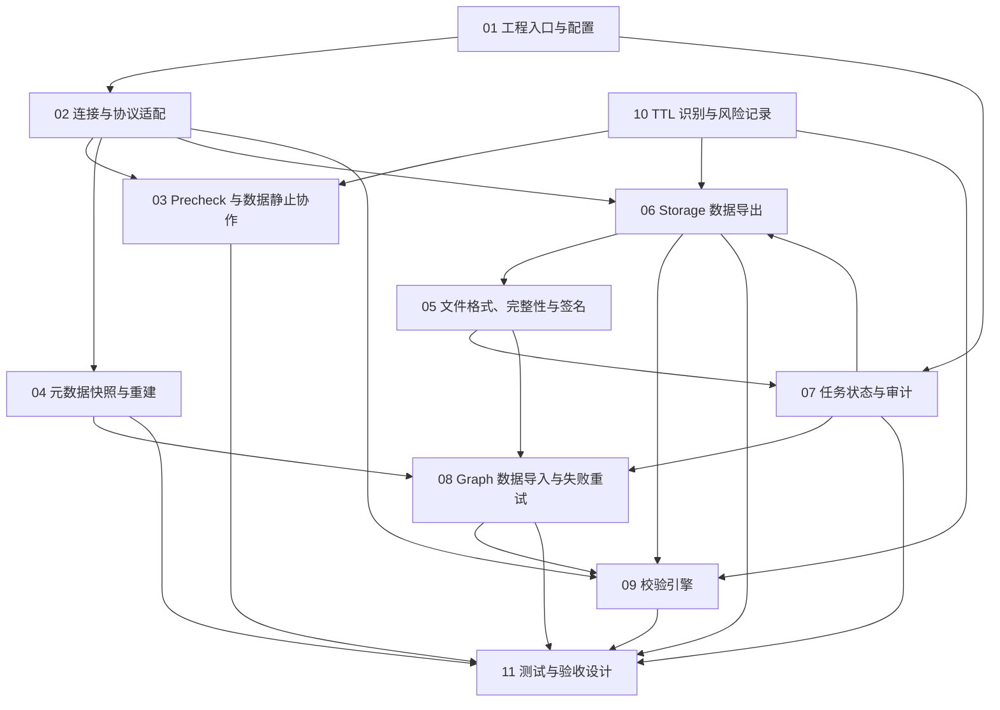

# 跨集群搬迁软件实现设计工作清单

## 1. 目的与边界

本文是 `migration-design.md` 的软件实现设计拆分清单，用于审阅模块边界和设计产出顺序。它不包含 Java、Shell 或 Nebula Graph 内核代码实现，也不改变已有总体方案。

实现范围固定为：Nebula Graph 3.8 同版本、一次性全量迁移、Java + Shell、nebula-java 直连 storage 导出和 graph nGQL 导入。`segment` 布局仅保留扩展设计，不进入本期代码实现。

## 2. 模块关系

其中，01、02、05、07 为基础设施；03、04、06、08、09、10 为核心迁移能力；11 定义验收和故障注入，不是独立运行时组件。数据静止内核能力属于 Nebula Graph graphd 改造，迁移工具只负责检查和报告其状态。

## 3. 设计文档拆分

| 编号 | 设计文档 | 对应总体方案章节 | 主要边界与交付物 | 前置依赖 |
| --- | --- | --- | --- | --- |
| 01 | 工程入口、CLI、配置与日志 | 4、17、18、19 | Maven 模块边界、命令模型、`.properties` 映射与校验、任务目录、log4j 初始化、退出码 | 无 |
| 02 | 集群连接与 Nebula 协议适配 | 4.2、7、8、9、13、14 | graph session、meta client、storage client 的生命周期、地址解析、认证、重连、异常归类、统一适配接口 | 01 |
| 03 | Precheck 与数据静止协作 | 6、7 | 源/目标检查矩阵、冻结状态读取接口、后台 job 判定、空目标判定、阻断与告警结果模型 | 01、02、10 |
| 04 | 元数据快照与目标重建 | 8 | space/tag/edge/index/user/role/permission 的读取模型、快照文件、nGQL 渲染、创建顺序、等待与失败退出语义 | 01、02、07 |
| 05 | 交换数据模型、文件格式与完整性 | 10、11 | typed value、CSV/JSON Lines 编解码、canonical 编码、SHA-256、HMAC-SHA256、原子完成语义 | 01 |
| 06 | Storage 数据导出 | 9、16.1 | scan 调用封装、label/partition 任务规划、并发模型、行映射、文件写入协作、导出恢复；包含 segment 的仅设计扩展 | 02、05、07、10 |
| 07 | Manifest、checkpoint、报告与失败审计 | 12、16、19 | 状态机、manifest 结构、原子更新、导出/导入 checkpoint、失败记录、进度汇总、三类报告 | 01、05 |
| 08 | Graph 数据导入与失败重试 | 13、16.2 | 完整性检查、元数据重建编排、CSV/JSON 读取、批量 `INSERT`、重试与单行降级、失败文件和恢复命令 | 02、04、05、07 |
| 09 | 校验引擎 | 14 | 分维度计数、确定性抽样、可选全量 canonical checksum、结果判定、verify report | 02、05、06、07、08、10 |
| 10 | TTL 识别与迁移风险处理 | 15 | TTL schema 探测、Nebula storage 读路径依据、warning 模型、manifest/report 标记、测试数据约束 | 02、07 |
| 11 | 测试、故障注入与性能验收设计 | 20、21 | 单元/集成/故障注入/性能场景、数据集补齐、环境拓扑、验收指标和证据产物 | 01-10 |

## 4. 每份设计文档的统一结构

为保证后续设计可直接进入编码评审，01-11 均使用以下固定章节：

1. 目标、非目标与方案约束。
2. 依赖的 `migration-design.md` 规则，以及需要核对的 nebula-java 或 Nebula Graph 源码依据。
3. 包/类/接口职责和调用关系图。
4. 核心数据模型、配置项、文件格式或 nGQL 契约。
5. 正常流程、失败流程、恢复语义和幂等边界。
6. 并发、资源限制和可观测性设计。
7. 与其他模块的接口和状态转换。
8. 单元测试、集成测试、故障注入测试要点。
9. 本模块完成准则与未决风险。

## 5. 关键边界决策

| 主题 | 归属模块 | 已确定决策 |
| --- | --- | --- |
| 数据冻结 | Nebula Graph graphd + 03 | graphd 通过 gflag 禁止变更语句；迁移工具不负责开关，只 precheck 和记录状态 |
| 元数据 | 04 | 先创建 space、schema、index，再创建非 root 用户和 space 级角色；root 只审计不修改 |
| 导出布局 | 06 | 默认 CSV + `label`；支持 `partition`；`segment` 仅设计不开发 |
| 完成判定 | 05、07 | 数据文件、SHA-256、HMAC 签名和 manifest `COMPLETED` 必须同时成立 |
| 导入幂等 | 08 | 目标必须为空；同 key 同值的重复 `INSERT` 可覆盖；不同值冲突不作为恢复手段 |
| 默认校验 | 09 | 数量一致 + 确定性抽样一致；全量 checksum 手工开启；关闭时报告必须说明未证明全量完全一致 |
| TTL | 10 | 不阻断；输出 log4j warning 和 manifest/report 标记；时间推进风险显式记录 |
| 清理行为 | 03、04、08 | 目标 precheck、schema/index 或数据导入失败时退出；工具绝不自动 `DROP SPACE` / `DROP USER` |

## 6. 建议设计产出顺序

建议先完成基础契约，再完成两条迁移数据链路，最后固化校验和测试：

1. 01 工程入口、02 连接适配、05 文件完整性、07 状态审计。
2. 03 Precheck、10 TTL、04 元数据搬迁。
3. 06 Storage 导出、08 Graph 导入与重试。
4. 09 校验引擎。
5. 11 测试与验收。

这样可先固定配置、文件、状态和错误契约，避免导出、导入、校验分别定义不兼容的数据模型或恢复语义。

## 7. 当前状态

| 编号 | 状态 |
| --- | --- |
| 01-11 | 已输出详细软件实现设计，待评审 |
| Java/Shell 业务代码 | 未启动 |
| 自动化测试代码 | 未启动 |
