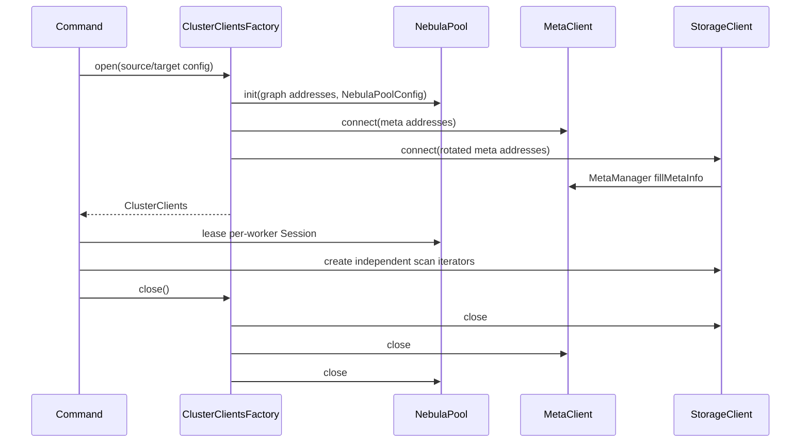

# 02. 集群连接与 Nebula 协议适配软件实现设计

> 状态：软件实现设计，未开始编码。
> 本模块是 nebula-java 的薄适配层，不复制或修改客户端连接池、Thrift 协议和 StorageClient 的 leader 路由逻辑。

## 1. 目标与边界

为源、目标两个集群提供受控的 graph、meta、storage 访问能力，并把 nebula-java 异常和 `ResultSet` 错误统一归类。导出只允许源 storage scan；导入只允许目标 graph nGQL；校验可使用目标 storage scan。

本模块不决定迁移顺序，不拼装具体 DDL/DML，不负责重试业务行，也不直接调用服务端 HTTP 写接口。

## 2. 源码依据

| 来源 | 关键位置 | 设计结论 |
| --- | --- | --- |
| nebula-java | `graph/net/NebulaPool.java:78-110,136-153` | `NebulaPool` 接受多 graphd 地址、创建连接池并通过 `getSession(user,password,reconnect)` 认证；工具为每个集群维护一个 pool。 |
| nebula-java | `graph/net/Session.java:91-150,153-210` | `Session.execute` 是同步方法且连接断开时可重连；单一 Session 会串行化调用，因此导入 worker 不共享同一个 Session。 |
| nebula-java | `graph/SessionPool.java:149-201,212-305` | 原生 `SessionPool` 自带重试并把语义/语法错误视为终止结果；迁移导入需要精确记录批次尝试次数，因此使用 `NebulaPool + 每 worker Session`，由 08 模块实现业务重试。 |
| nebula-java | `graph/data/ResultSet.java:144-184,284-295` | 成功、错误码、错误消息和结果行都可从 `ResultSet` 读取，适合作为统一 graph 响应模型。 |
| nebula-java | `storage/StorageClient.java:106-115` | `connect()` 首先打开 `addresses.get(0)`，随后创建 `StorageConnPool` 和 `MetaManager`；工厂必须处理首个 meta 地址不可用的情况。 |
| nebula-java | `meta/MetaManager.java:122-177,296-357` | `MetaManager` 缓存 space、schema、partition 分配与 leader；StorageClient 可据此路由多台 storaged。 |
| nebula-java | `storage/scan/ScanResultIterator.java:138-142` | scan 迭代器会处理 `E_LEADER_CHANGED` 并刷新 leader；迁移层不应自行缓存 storage leader。 |
| Nebula Graph 3.6 | `/home/sch/nebula/nebula-3.6-io/src/graph/service/QueryInstance.cpp:39-104` | graph 请求经过解析、校验、优化和执行；工具必须把 graph 返回的语义错误和网络错误区别处理。 |

## 3. 包结构与接口

```text
com.vesoft.nebula.migration.cluster
  ClusterEndpoint, ClusterConnectionConfig, ClusterClients
  GraphClient, GraphSessionLease, GraphCommandResult
  MetaClientAdapter, StorageClientAdapter
  StorageClientFactory, ClusterProbe, ErrorClassifier
  CloseableRegistry
```

| 接口/类型 | 职责 |
| --- | --- |
| `ClusterEndpoint` | 不可变地址列表、账号、TLS 和超时参数；`toString()` 只输出脱敏信息。 |
| `ClusterClients` | 一个集群的聚合根：`NebulaPool`、`MetaClientAdapter`、`StorageClientAdapter`；按关闭顺序统一释放。 |
| `GraphClient` | `execute(String ngql, QueryOptions)` 和 `leaseSession()`；返回 `GraphCommandResult`，不暴露原始 Session 给业务层。 |
| `GraphSessionLease` | 一个 worker 独占的 `Session`，记录已绑定 space；释放时归还/释放连接。 |
| `MetaClientAdapter` | 封装 `MetaClient.getSpaces/getSpace/getTags/getTag/getEdges/getEdge/getPartsAlloc/getHostItems`。 |
| `StorageClientAdapter` | 只暴露 `scanVertex`、`scanEdge` 和 space partition 列表；隐藏 `StorageClient` 构造细节。 |
| `StorageClientFactory` | 对 meta 地址列表做循环移位重试：每次让一个可达地址位于第一个位置，再调用 `StorageClient.connect()`。 |
| `ErrorClassifier` | 将 `IOErrorException`、Thrift/连接异常、`ResultSet` 失败码和本地 I/O 映射为稳定 `ErrorCategory`。 |

## 4. 生命周期与并发模型



`StorageClient` 在一个导出任务内只创建一个实例，以满足“一个 nebula-java client 连接多台 storage、按 partition 并行导出”的要求。每个 partition 调用创建独立 scan iterator；其底层的 `StorageConnPool` 和 `MetaManager` 负责路由。由于当前公开 API 未显式给出 `StorageClient` 多 iterator 的线程安全承诺，06/11 模块必须增加并发 scan 集成测试；在测试未通过前不提高 `export.concurrent.partitions`。

Graph 导入使用一个共享 `NebulaPool` 和多个 `GraphSessionLease`。每个 lease 仅由一个导入 worker 使用，规避 `Session.execute` 的 `synchronized` 串行化。每次 worker 切换 space 时显式执行 `USE <space>` 并检查 `ResultSet.isSucceeded()`。

## 5. 连接配置映射

| 工具配置 | nebula-java 映射 | 说明 |
| --- | --- | --- |
| `*.graph.addresses` | `List<HostAddress>` -> `NebulaPool.init` | 所有 graphd 都传入 pool，避免工具自行做负载均衡。 |
| `*.meta.addresses` | `List<HostAddress>` -> `MetaClient` / `StorageClient` | storage 的地址来自 meta，不单独配置 storage host。 |
| `*.timeout.ms` | `NebulaPoolConfig.timeout`、`MetaClient` / `StorageClient` 构造参数 | 未配置时使用工具固定默认并写 manifest。 |
| `*.connection-retry`、`*.execution-retry` | `MetaClient` / `StorageClient` 构造参数 | 仅处理连接和协议层 retry，不取代导入 DML retry。 |
| `*.ssl.enabled` 及证书项 | nebula-java `SSLParam` | 配置完整性先于创建客户端校验。 |

禁止从 `SHOW HOSTS` 结果反向推导可连接的 storage 地址后绕过 `StorageClient`。`MetaManager` 已保存 partition leader 与可选地址映射，直接复用可减少 leader 漂移时的重复实现。

## 6. 错误分类

| 分类 | 来源示例 | 上层动作 |
| --- | --- | --- |
| `CONFIG` | 非法地址、TLS 配置不完整 | 启动前失败，退出码 2。 |
| `AUTH` | `AuthFailedException` | precheck 阻断，退出码 4。 |
| `CONNECTIVITY` | `IOErrorException`、`TException`、全部 graphd 不可用 | 可按命令策略重试；超过限制时保留状态并失败。 |
| `TOPOLOGY` | `E_LEADER_CHANGED`、meta leader 变化 | 交由 nebula-java 刷新；仍失败则按连接类错误处理。 |
| `NGQL_SEMANTIC` | `ResultSet` 语义/语法失败 | 不作为瞬时重试；导入进入单行降级或元数据失败路径。 |
| `REMOTE_RETRYABLE` | graph 返回临时服务/执行错误 | 08 模块按批重试。 |
| `LOCAL_IO` | 文件、manifest、锁异常 | 07 模块持久化失败状态。 |

`GraphCommandResult` 必须保留原始 error code、message、是否成功、执行耗时和经过脱敏的 nGQL 摘要。绝不把含字符串属性的完整 INSERT 默认写 INFO 日志。

## 7. 探测接口

`ClusterProbe` 提供只读探测：

1. `probeGraph()`：租用 Session 执行 `SHOW SPACES`，验证认证和 nGQL。
2. `probeMeta()`：调用 `MetaClient.getSpaces()` 与 `getHostItems()`。
3. `probeStorage()`：仅初始化 StorageClient 和读取 partition 元数据；不在 precheck 扫描业务数据。
4. `probeVersion()`：由 03 模块通过 `SHOW HOSTS`/服务信息适配器取得版本并检查主版本为 3.8。

探测返回结构化 `ProbeResult`，而不是把异常文本作为判断依据。连接对象在命令结束前保持复用，避免 precheck、export、verify 分别产生不可观测的连接参数差异。

## 8. 测试与完成准则

单元测试复用 nebula-java 的连接测试思路，参考 `client/src/test/java/com/vesoft/nebula/client/graph/net/TestSession.java` 和 `client/src/test/java/com/vesoft/nebula/client/meta/TestMetaClient.java`：多 graphd 地址、单 graphd 故障、认证失败、meta 首地址故障但后续地址可用、storage leader 变化、资源重复关闭。

完成标准：源端一个 `StorageClient` 能通过 meta 路由多个 storaged 并由多个 partition worker 使用；目标端多个导入 worker 不共享 Session；任何底层错误都可被上层稳定分类并包含 cluster/space/partition 上下文。
