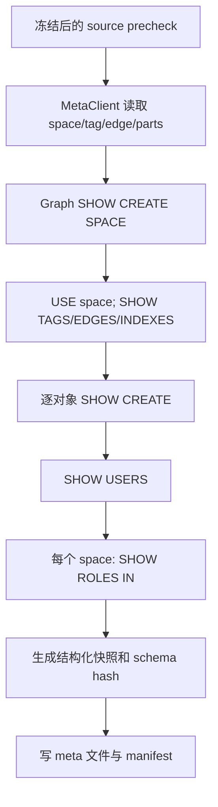
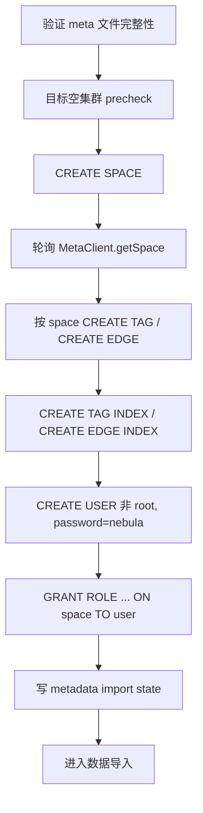

# 04. 元数据快照与目标重建软件实现设计

> 状态：软件实现设计，未开始编码。
> 本模块迁移逻辑元数据，不迁移 job 运行信息、全文索引、配置、快照、日志、storage host/leader/Raft 物理状态，也不复制 root 密码或修改目标 root。

## 1. 目标与边界

导出并重建：space、tag schema、edge schema、native tag/edge index、非 root 用户、非 root 的 space 级角色授权。密码不从源端导出；目标非 root 用户统一以默认密码 `nebula` 创建。商业版扩展权限无法完整读取时写 warning/report。

导入前必须已经通过目标空集群 precheck。schema/index 创建失败立即退出，工具不自动 `DROP SPACE` 或 `DROP USER`，由用户清理目标后重试。

## 2. 源码依据

| 来源 | 关键位置 | 设计结论 |
| --- | --- | --- |
| nebula-java | `meta/MetaClient.java:194-478` | 高层 MetaClient 支持 spaces、tag/edge、schema、parts、hosts，适合形成结构化 schema/partition 快照。 |
| nebula-java | `meta/MetaManager.java:122-177` | 客户端缓存的 meta 模型包含 space、tag、edge 和 partition；元数据读取要在冻结后执行，避免缓存前后不一致。 |
| nebula-java | `graph/net/Session.java:85-150`、`graph/data/ResultSet.java:144-295` | graph Session 可以执行任意 nGQL，并读取 `SHOW CREATE`、`SHOW USERS`、`SHOW ROLES` 的动态结果集。 |
| Nebula Graph 3.6 | `src/parser/parser.yy:3333-3356,3586-3603` | 服务端语法支持 `SHOW USERS`、`SHOW ROLES IN`、`SHOW CREATE SPACE/TAG/EDGE/TAG INDEX/EDGE INDEX`、`CREATE USER` 等命令。 |
| Nebula Graph 3.6 | `src/graph/validator/ACLValidator.cpp:20-79` | `CREATE USER` 和 root 的 ACL 边界由服务端校验；工具仍应在导入前排除 root。 |
| Nebula Graph 3.6 | `src/meta/MetaServiceHandler.h:92-147` | meta 服务实际具备 index/user/role API；当前 nebula-java 高层 `MetaClient` 未逐一封装，因此本期优先使用稳定 nGQL 读取这些对象。 |
| Nebula Graph 3.6 | `src/graph/validator/MaintainValidator.cpp:274-459` | `SHOW CREATE` 是已有的 validator/plan 路径，保存它的结果可避免手工重建复杂 TTL、VID、comment、schema 细节。 |

## 3. 快照模型与文件

```text
meta/
  metadata-snapshot.json
  schema.json
  users.json
  roles.json
  unsupported-privileges.json
```

所有 JSON 使用 05 模块的固定 JSON 编码并由 07 模块登记 checksum/状态。`metadata-snapshot.json` 是入口，包含工具版本、源版本、捕获时间、space 列表和各文件 SHA-256。

| 模型 | 关键字段 | 来源 |
| --- | --- | --- |
| `SpaceMeta` | name、spaceId、vidType、partitionNum、replicaFactor、createNgql、schemaHash | MetaClient + `SHOW CREATE SPACE` |
| `LabelSchemaMeta` | space、kind、name、id/type、columns、schemaProp、createNgql、schemaHash | MetaClient `getTag/getEdge` + `SHOW CREATE` |
| `IndexMeta` | space、kind、name、targetLabel、fields、createNgql | `SHOW TAG/EDGE INDEXES` + `SHOW CREATE ... INDEX` |
| `UserMeta` | username、sourceRoot、targetAction、passwordPolicy | `SHOW USERS`；不保存密码 hash/明文 |
| `RoleGrantMeta` | username、space、role | 对每个 space 执行 `SHOW ROLES IN <space>` |
| `UnsupportedPrivilege` | subject、kind、sourceEvidence、reason | 商业版扩展权限 capability probe |

schema snapshot 同时保存 `SHOW CREATE` 原始 DDL 和结构化字段。导入以 `createNgql` 为主，结构化字段用于 CSV/JSON 解码、TTL 检测和 schema hash；这避免同版本迁移中手写 DDL 丢失 `vid_type`、TTL、comment 或默认值。

## 4. 导出流程



具体规则：

1. 使用 `MetaClient.getSpaces()` 获取权威 space 清单；空间按 UTF-8 字节序稳定排序。
2. 每个 space 读取 `getSpace/getTags/getTag/getEdges/getEdge/getPartsAlloc`，保存列顺序、类型、TTL schema prop 和 partition 数。
3. 通过 graph Session 读取 `SHOW CREATE SPACE`、每个 tag/edge 的 `SHOW CREATE`，以及每个 native index 的 `SHOW CREATE`。ResultSet 列名不硬编码，`ShowCreateResultParser` 要求单行中存在唯一 DDL 字符串列。
4. 全文索引只记录 `excluded=true, reason=FULLTEXT_INDEX_OUT_OF_SCOPE`，绝不生成导入 DDL。
5. `SHOW USERS` 中 `root` 写入审计项 `sourceRootPresent=true`；其余用户生成 `UserMeta(targetAction=CREATE_WITH_DEFAULT_PASSWORD)`。
6. 对每个 space 执行 `SHOW ROLES IN <space>`，仅保存非 root 用户的 space 级角色。无法识别的角色/扩展权限写 `unsupported-privileges.json` 和 WARN。
7. 计算每个对象的 canonical schema hash：对象 kind、名称、列顺序、类型、nullable/default、TTL prop 和 create DDL 的规范化表示均参与哈希。

## 5. 目标重建流程



导入规则：

1. 全部 DDL 使用快照中的同版本 `SHOW CREATE` 结果，先通过 `NgqlSafetyValidator` 确认首关键字和对象名称与快照匹配，再交给 `GraphClient` 执行。
2. 每创建一个 space，等待 `MetaClientAdapter.getSpace(space)` 可见后才创建该 space 的 schema。等待采用固定最大时限，超时作为 schema 阶段失败。
3. 先创建全部 tag/edge，再创建 native index，满足“先建 index 再导入数据”的既定要求；不提交 `REBUILD INDEX` job。
4. 用户创建固定渲染为 `CREATE USER <escaped-user> WITH PASSWORD "nebula"`。root 永远不生成 DDL。
5. 授权只生成 `GRANT ROLE <role> ON <space> TO <user>`；任何不在能力清单内的权限只报告，不伪造等价权限。
6. 任一 CREATE/GRANT 返回失败时，状态置为 `FAILED_METADATA_IMPORT` 并退出码 6；不尝试回滚或删除已创建对象。

## 6. 包和接口设计

```text
com.vesoft.nebula.migration.metadata
  MetadataExporter, MetadataImporter, MetadataSnapshot
  GraphShowReader, ShowCreateResultParser, MetaSchemaReader
  MetadataSnapshotWriter, MetadataSnapshotReader
  NgqlSafetyValidator, MetadataNgqlRenderer, SchemaAvailabilityWaiter
  UnsupportedPrivilegeDetector
```

`MetadataExporter` 只产生不可变 `MetadataSnapshot`；`MetadataImporter` 只消费已签名的快照。两者都不直接操作 manifest，而是向 07 模块发布 `MetadataEvent`。这样文件状态、元数据状态和报告不会由多个模块并发写入。

## 7. 失败、恢复与审计

元数据导出失败可在 source 仍冻结时重新执行，覆盖未完成 `meta/*.tmp`；已完成快照只有在 checksum、签名和 manifest 状态全部通过时复用。元数据导入不提供细粒度 resume：因为目标必须为空且 schema/index 半初始化需要人工清理，恢复入口是用户清理后重新执行 `import`。

报告至少列出：source/target root 审计、创建的 space/tag/edge/index/user/grant 数、跳过的全文索引、未迁移扩展权限、失败的 nGQL 摘要和手工清理提示。

## 8. 测试与完成准则

单元测试覆盖 SHOW CREATE 结果解析、DDL 安全校验、标识符/密码字符串转义、schema hash 稳定性、root 排除、角色去重、扩展权限告警。集成测试覆盖多 space、多 tag/edge、TTL、native index、字符串/整数 VID、非 root 用户与多 space 角色、目标已有对象失败。

完成标准：同版本源集群的快照能在空目标上按既定顺序重建可扫描的 schema；root 未被修改；全文索引和 job 信息不被迁移；所有无法完整迁移的权限都有可审计 warning。
