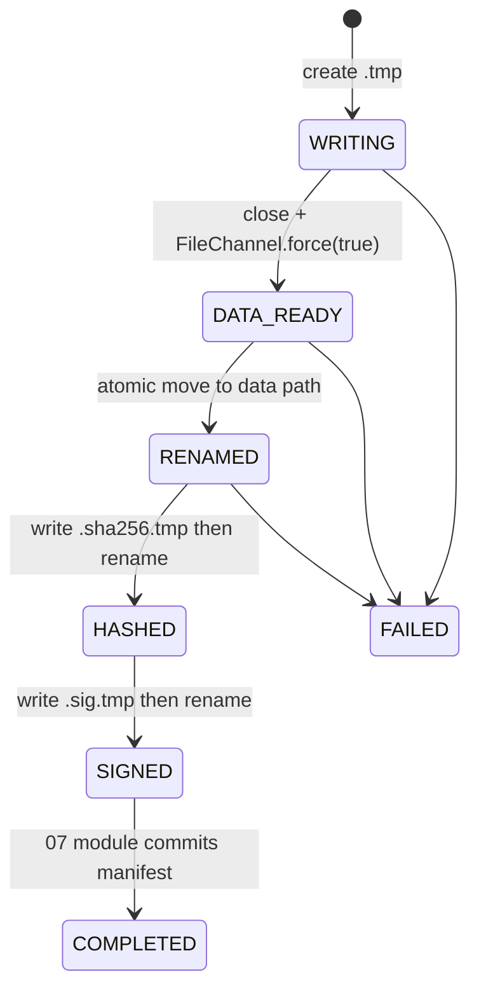

# 05. 交换数据模型、文件格式与完整性软件实现设计

> 状态：软件实现设计，未开始编码。
> 本模块定义导出文件、typed value、canonical row、文件 SHA-256 与 HMAC 完成标记。它不决定扫描并发、导入重试或 manifest 状态机。

## 1. 目标与边界

导出文件必须长期保存、可审计、可恢复，并在 CSV/JSON 两种格式下保持 Nebula 属性和 VID 语义。CSV 默认为交付格式，JSON 使用 JSON Lines。文件本身的 SHA-256 用于完整性；固定 HMAC-SHA256 仅用作“该文件已完整导出”的完成标记，不承诺对抗持有默认密钥的攻击者。

`segment` 布局不进入本期实现；本模块的文件契约仍为未来 segment 复用。

## 2. 源码依据

| 来源 | 关键位置 | 设计结论 |
| --- | --- | --- |
| nebula-java | `graph/data/ValueWrapper.java:153-190,327-460,576-587` | `ValueWrapper` 以 Thrift `Value` 的 set field 区分 NULL、整数、浮点、字符串、日期时间等，不能用 `toString()` 作为迁移编码。 |
| nebula-java | `storage/data/VertexRow.java:15-31` | vertex scan 行把 VID 暴露为 `ValueWrapper`，属性以 map 暴露。 |
| nebula-java | `storage/data/EdgeRow.java` 及 `storage/data/EdgeTableRow.java:21-49` | edge 的 `_src`、`_dst`、`_rank` 是独立 key，导出/导入/canonical hash 都必须包含。 |
| nebula-java | `storage/StorageClient.java:437-477,929-957` | scan 结果的 property columns 由调用方 `returnCols` 决定，文件列顺序必须以元数据 snapshot 的 schema 顺序固定。 |
| Nebula Graph 3.6 | `src/storage/exec/ScanNode.h:120-180` | storage scan 先产出 VID，再按 requested property 收集 Value；typed value 和列顺序不能依赖 map 遍历。 |
| Nebula Graph 3.6 | `src/storage/exec/ScanNode.h:72-116` | scan 以 partition 内 key range 迭代，并返回 cursor；canonical 校验按 space/kind/label/partition 建立边界。 |

## 3. 统一行模型

```text
MigrationRow
  rowKind: VERTEX | EDGE
  space: String
  label: String
  partition: int
  key: VertexKey | EdgeKey
  properties: List<NamedTypedValue>   // 严格按 SchemaSnapshot 列顺序
  schemaHash: String

TypedValue
  type: NULL | BOOL | INT | FLOAT | STRING | DATE | TIME | DATETIME | GEOGRAPHY
  payload: byte[] / primitive structured fields
```

本期 schema property 类型只接受 Nebula 3.8 可作为 tag/edge property 的标量/地理类型。若 scan 返回 list、map、vertex、edge、path、dataset 或 empty 等非 schema 属性值，`TypedValueAdapter` 视为不支持类型并使该 export unit 失败，不能悄悄字符串化。

`ValueWrapperAdapter` 必须按 `isNull/isBoolean/isLong/isDouble/isString/isDate/isTime/isDateTime/isGeography` 分支转换；字符串通过原始 UTF-8 bytes 读取，浮点同时保存 IEEE-754 raw bits 与显示文本，避免 `NaN`、`-0.0`、精度和本地化格式造成歧义。VID 使用 `VID_INT` 或 `VID_STRING` 独立编码，类型由 `SpaceMeta.vidType` 与 ValueWrapper 一致性校验共同决定。

## 4. CSV 格式

CSV 使用 RFC4180 风格的流式编码，UTF-8，无 BOM。每个数据文件的列定义来自 metadata snapshot，不在行内推断类型：

```text
Vertex: _vid,<schema property columns in order>
Edge:   _src,_dst,_rank,<schema property columns in order>
```

编码规则：

| 值 | CSV 表示 | 读取规则 |
| --- | --- | --- |
| NULL | 未加引号的 `\N` | 仅未加引号的该 token 解析为 NULL。 |
| 空字符串 | 加引号的空字段 `""` | 解析为 STRING 空值。 |
| 普通字符串 | 必要时加双引号，内部 `"` 写为 `""` | 根据 schema 解析为 STRING；加引号的 `\N` 是字符串而非 NULL。 |
| 整数 | 十进制 ASCII | 按 schema 精确解析为 INT。 |
| 浮点 | IEEE raw bits 的十六进制文本 `0x...` | 不用本地化小数文本；导入重建为原始 double/float 位模式。 |
| BOOL | `true` / `false` | 小写固定值。 |
| DATE/TIME/DATETIME | 固定 ISO-8601-like Nebula 字面量字段 | 由 schema 类型解析，时区/精度字段明确写入 metadata。 |
| GEOGRAPHY | canonical WKT/GeoJSON 受控表示 | 由 `TypedValueCodec` 规范化，不能调用对象 `toString()`。 |

实现 `StreamingCsvWriter` 和 `StreamingCsvReader`，不引入 CSV 第三方库。Reader 必须保留字段是否被双引号包围的信息，因为 `\N` 字符串与 NULL 的判定依赖该信息；支持带双引号、逗号和换行的字符串字段。物理行号只用于诊断，导入 checkpoint 使用逻辑 record number，避免带换行字符串破坏恢复。

## 5. JSON Lines 格式

每行一个固定结构 JSON 对象，所有值显式带 type：

```json
{"formatVersion":1,"kind":"VERTEX","space":"basketballplayer","label":"player","partition":1,"vid":{"type":"VID_STRING","base64":"cGxheWVyMTAw"},"props":[{"name":"name","value":{"type":"STRING","base64":"VGltIER1bmNhbg=="}},{"name":"age","value":{"type":"INT","value":"42"}}]}
```

JSON 写入和读取实现为受限的内部 `JsonLinesCodec`，只接受本格式的对象、数组、字符串、数字和布尔字面量；不直接把 fastjson 作为新的工具 API。所有任意字节字符串使用 base64，避免 JSON 转义或字符集差异破坏审计数据。

## 6. Canonical 编码与 full checksum 输入

canonical 编码与 CSV/JSON 文本独立，采用长度前缀二进制 TLV：

```text
version | space | kind | label | partition | schemaHash |
key-kind | key-values | property-count | repeated(name | type | canonical-value)
```

所有长度为无符号 32 位大端；属性按 schema 列序；字符串和 VID 使用原始 UTF-8 bytes；浮点使用 raw bits；NULL、空字符串和不存在的属性严格区分。`CanonicalRowHasher` 输出 `SHA-256(canonicalBytes)`，供 06 模块导出、09 模块抽样/全量校验共用。

## 7. SHA-256、签名与文件完成协议

使用 JDK `MessageDigest` 计算 `SHA-256(data file bytes)`，使用 `Mac.getInstance("HmacSHA256")` 计算签名。签名输入为：

```text
signatureVersion | relativePath | format | layout | space | kind | label | partition |
rowCount | byteSize | sha256 | schemaHash
```

固定内置密钥以 `keyId=default-v1` 标识，密钥值不写入 manifest、日志或报告。验签只能证明产物按工具流程完成，不能作为安全防篡改承诺。

完成顺序：



`FileCompletionChecker` 只有在正式文件、`.sha256`、`.sig` 均存在且验证通过、manifest file state 为 `COMPLETED` 时返回 true。label 布局中任一条件不满足，整个 label 文件重导；partition 布局只重导该 partition 文件。

## 8. 包和测试

```text
com.vesoft.nebula.migration.format
  MigrationRow, TypedValue, ValueWrapperAdapter
  StreamingCsvWriter, StreamingCsvReader, JsonLinesCodec
  CanonicalEncoder, CanonicalRowHasher, NgqlLiteralRenderer
com.vesoft.nebula.migration.integrity
  Sha256FileHasher, HmacSigner, FileCompletionChecker, AtomicArtifactWriter
```

单元测试必须覆盖：NULL 与字符串 `\N`、空字符串、逗号/引号/换行、UTF-8、多字节 VID、整数 VID、`-0.0`、NaN、Infinity、日期/时间/日期时间、CSV/JSON 往返、canonical hash 稳定性、篡改后 checksum/signature 失败、崩溃遗留 `.tmp` 不被视为完成。

完成标准：同一 `MigrationRow` 经 CSV 或 JSON 读回后 canonical hash 相同；数据文件每一字节被 SHA-256 覆盖；没有签名和 manifest 完成状态的文件绝不被导入或续导跳过。
