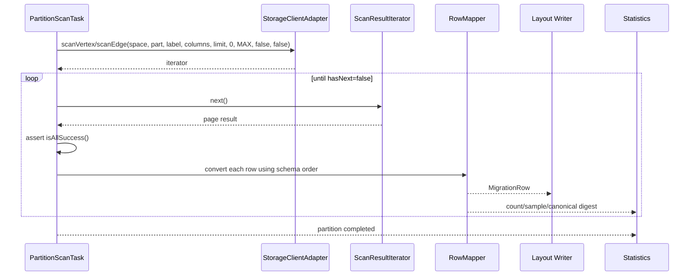
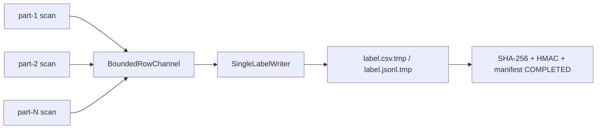

# 06. Storage 数据导出软件实现设计

> 状态：软件实现设计，未开始编码。
> 实现范围：CSV/JSON、`label` 和 `partition` 布局；`segment` 仅保留扩展设计。导出从源集群 `StorageClient.scanVertex/scanEdge` 直连 storage，不通过 graph 查询读取业务数据。

## 1. 目标与边界

导出所有 space 的 vertex tag 和 edge type，并生成可导入的 `MigrationRow` 数据文件、每个 partition 的计数/抽样/checksum 元数据、文件完整性产物和状态事件。导出必须在源集群冻结且 precheck 成功后开始。

不迁移 job 运行信息、全文索引、服务端配置、快照、日志和物理 storage topology。导出不改变源集群；任一 partition scan 不能被“部分成功”掩盖。

## 2. 源码依据

| 来源 | 关键位置 | 设计结论 |
| --- | --- | --- |
| nebula-java | `storage/StorageClient.java:410-477,910-957` | 有按 `space + partition + tag/edge + returnCols + limit + time range + allow flags` 的 scan overload；本模块始终调用具体 partition 的 overload。 |
| nebula-java | `storage/StorageClient.java:1175-1179` | 客户端默认 scan limit 为 1000，`allowPartSuccess=false`、`allowReadFromFollower=false`；迁移配置沿用这两个安全值并显式传入。 |
| nebula-java | `storage/scan/ScanVertexResultIterator.java:63-107` | 每次 `next()` 会向 storage 发起新的 scan request；iterator 持有 cursor，必须完整消费至 `hasNext()==false`。 |
| nebula-java | `storage/scan/ScanResultIterator.java:138-142` | `E_LEADER_CHANGED` 会刷新 leader；外层不能把旧 leader 当作永久失败。 |
| nebula-java | `storage/scan/ScanVertexResult.java:103-130`、`ScanEdgeResult.java:86-100` | 页面结果必须检查 `isAllSuccess()`，再读取 vertex/edge 行。 |
| nebula-java | `storage/data/VertexRow.java`、`storage/data/EdgeRow.java` | vertex key 与 edge `_src/_dst/_rank` 均可从行对象得到，不能把 edge rank 丢弃。 |
| nebula-java | `meta/MetaManager.java:296-357` | partition 列表和 leader 来自 meta cache；单一 StorageClient 能经 MetaManager 访问多台 storaged。 |
| Nebula Graph 3.6 | `/home/sch/nebula/nebula-3.6-io/src/storage/exec/ScanNode.h:58-117` | 服务端 scan 以 partition 内 prefix/range 和 cursor 持续遍历；一次 scan page 不等于整个 partition。 |
| Nebula Graph 3.6 | `src/storage/exec/ScanNode.h:120-180` | scan 先输出 VID/edge key，再按请求列收集属性；导出字段顺序必须按 snapshot schema 请求。 |

## 3. 包与职责

```text
com.vesoft.nebula.migration.exporter
  StorageExporter, ExportPlanner, ExportUnit, ExportCoordinator
  PartitionScanTask, StorageScanAdapter, ScanPageConsumer
  VertexRowMapper, EdgeRowMapper, ExportStatisticsCollector
  LabelLayoutExporter, PartitionLayoutExporter
  BoundedRowChannel, ExportRetryPolicy
```

| 类型 | 职责 |
| --- | --- |
| `ExportPlanner` | 从 04 模块 `MetadataSnapshot` 生成稳定排序的 `ExportUnit(space,kind,label,partitions)`。 |
| `StorageScanAdapter` | 调用 02 模块单一 `StorageClientAdapter`，显式传入 scan limit、时间范围和两个 allow flag。 |
| `PartitionScanTask` | 只负责一个 `space + kind + label + partition`；完整消费 cursor，映射 row，统计 count/sample/full checksum。 |
| `LabelLayoutExporter` | 多个 partition task 经有界队列将 row 交给一个串行 writer，生成一个 label 文件。 |
| `PartitionLayoutExporter` | 每个 partition task 独占一个临时文件和 writer，独立完成 SHA/signature。 |
| `ExportStatisticsCollector` | 收集 per-partition count、sample、canonical digest、耗时与重试信息，向 07 模块发布事件。 |
| `ExportRetryPolicy` | 对可恢复 scan 异常整体重扫未完成 partition；不在半个文件中续接 storage cursor。 |

## 4. 任务规划与并发

执行顺序固定为：space 按名称排序 -> vertex tag 排序 -> edge type 排序 -> partition id 升序。默认值：

```properties
export.scan.limit=1000
export.concurrent.partitions=8
export.concurrent.labels=1
export.writer.queue.capacity=2000
export.retry.max-attempts=3
export.retry.backoff.ms=1000
```

新增的 queue/retry 参数均为启动时静态值，不提供热生效。`export.concurrent.labels=1` 表示同一时刻只执行一个 label/edge export unit；该 unit 内最多 8 个 partition task 并发。这样既满足 partition 级并发，也把多 label 的峰值内存和对 source storaged 的压力限制在可预测范围。

`StorageClient` 只创建一个实例并由所有 `PartitionScanTask` 使用。每个 task 调用具体 partition overload，不调用全 space overload，避免客户端内部按 leader 并行与工具线程池叠加产生不可控并发。11 模块必须验证这一个 client 的并发 iterator 使用；验证未通过时实现退化为一个 client + 单 partition 线程，而不是创建额外 StorageClient 规避问题。

## 5. 每 partition 扫描流程



具体规则：

1. `returnCols` 取 `LabelSchemaMeta` 的所有属性列，严格按 snapshot 列顺序；不得使用 scan 结果 map 的迭代顺序。
2. 参数固定 `startTime=0`、`endTime=Long.MAX_VALUE`、`allowPartSuccess=false`、`allowReadFromFollower=false`。本期不使用写入时间窗口过滤。
3. `next()` 抛异常、返回非 `isAllSuccess()`、属性类型不匹配、writer 通道关闭均使该 partition task 失败。
4. 由 nebula-java 处理 leader 刷新；若 task 最终仍是 `CONNECTIVITY/TOPOLOGY` 可恢复错误，则从 partition 开头重新 scan。因为未生成签名的文件不能被复用，重扫不会产生完成产物冲突。
5. 每个 row 在入 writer 前由 05 模块转换为不可变 `MigrationRow`。task 立即累加该 partition 的行数、确定性样本和可选 canonical digest；这些统计不能从最终 label 大文件倒推。
6. 发现 TTL schema 不改变 scan/统计逻辑，但附带 10 模块提供的 `ttlAffected=true` 标记。

## 6. label 布局实现



`LabelLayoutExporter` 为一个 tag/edge 创建一个 `BoundedRowChannel<MigrationRow>` 和一个 writer。writer 是该文件唯一写入者，保证 RFC4180/JSON Lines 流连续；不承诺 partition 之间的行顺序。每个 partition task 成功后发送 `PartitionFinished`，writer 仅在全部预期 partition 成功、通道关闭且已 flush 后进入 05 模块的文件完成协议。

恢复规则：label 文件只有在 data、`.sha256`、`.sig` 和 manifest file state 均完成时跳过。任一缺失时删除/隔离该 unit 的 `.tmp` 和未完成 sidecar，重新扫描整个 tag/edge；不尝试拼接部分 partition 输出，避免无法证明单文件内容完整。

## 7. partition 布局实现

每个 `PartitionScanTask` 独占：

```text
data/<space>/vertices/<tag>/part-000001.<csv|jsonl>.tmp
data/<space>/edges/<edge>/part-000001.<csv|jsonl>.tmp
```

task 扫描成功后自己 flush、close、hash、sign，并发布文件 `COMPLETED` 事件。不同 partition 文件可并行完成，07 模块以单写者串行提交 manifest。恢复时只跳过完成判定通过的 partition 文件，未签名或校验失败文件从头重扫。

## 8. segment 扩展设计（不实现）

未来 `segment` 在 partition task 内增加 `SegmentBoundaryPolicy`，按行数或字节数切分：

```text
data/<space>/vertices/<tag>/part-000001/segment-000000.csv
```

每 segment 复用 05/07 的独立 checksum、signature 和状态。当前代码不得预先实现 segment writer、配置或命令，只保留 `ExportUnit` 中可扩展的 `segmentId` nullable 字段。

## 9. OOM、防压与失败语义

有界通道是唯一允许 partition worker 与 label writer 之间传递完整 row 的缓存；writer 慢时 worker 阻塞，不累积无界 List。page 内行逐个映射和发送，禁止收集整个 partition。大字段、复杂字符串和 JSON 编码都在 writer 线程完成后尽快释放引用。

导出失败时：停止该 export unit 的新 task，取消尚未开始的 task，保留完成文件和失败 evidence，向 07 模块写 `FAILED_EXPORT`。label 布局的其他完成 partition 统计可保留作诊断，但不能被当作可恢复数据；partition 布局的已签名 sibling 文件可复用。

## 10. 测试与完成准则

单元测试覆盖 task 规划、columns 顺序、VertexRow/EdgeRow key 映射、queue 背压、错误分类、label completion barrier、partition 完成跳过和 retry 起点。集成测试以 nebula-java `StorageClientTest` 的 vertex/edge scan 场景为基础，增加 3 storage、leader 变化、kill export、删除 sig、字符串/整数 VID、多 tag/edge、TTL 和两种布局。

完成标准：默认 label 和 partition 两种布局均能用一个 source `StorageClient` 导出完整数据；任何 page 非全成功都不能形成已签名文件；中断恢复绝不把未签名数据当作成功；统计精确到 space/tag/edge/partition。
