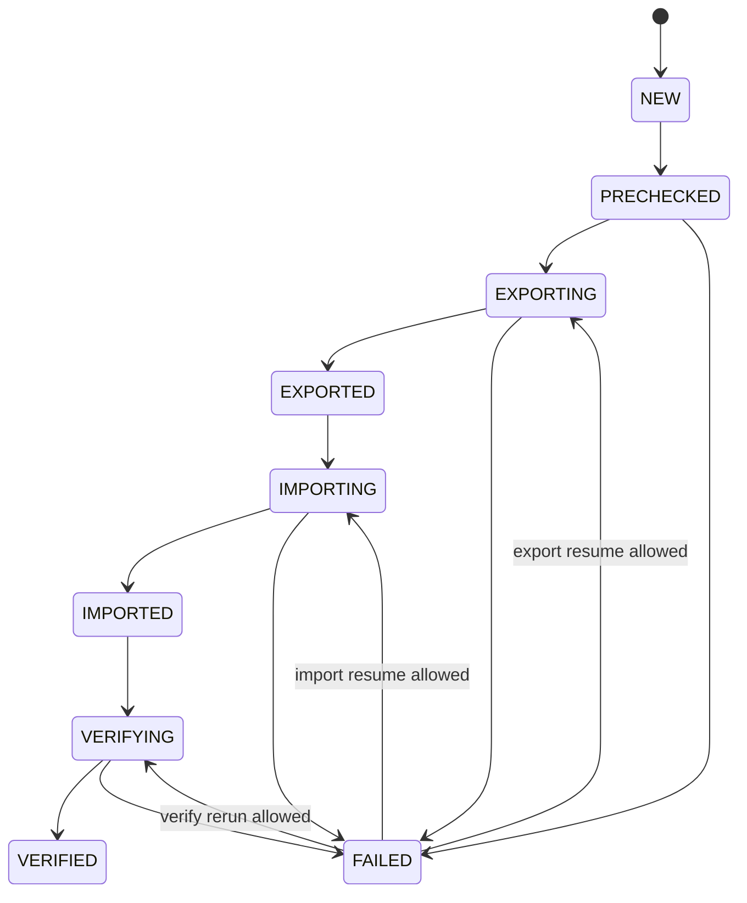

# 07. Manifest、Checkpoint、报告与失败审计软件实现设计

> 状态：软件实现设计，未开始编码。
> 本模块是迁移任务的持久状态唯一写入口。导出、导入、校验模块只能发布事件，不能各自并发修改 `manifest.json`。

## 1. 目标与边界

提供任务级状态管理、可审计交付物、断点续导/续导入和失败记录。manifest 既是恢复入口，也是最终证据索引。状态写入必须崩溃安全，且一个数据文件只有在 05 模块完成 checksum/signature 后才能被标记完成。

本模块不解析数据 row、不执行 nGQL、不计算业务 checksum；它保存其他模块的结构化结果。

## 2. 源码依据

| 来源 | 关键位置 | 设计结论 |
| --- | --- | --- |
| nebula-java | `storage/scan/ScanResultIterator.java:80-82`、`ScanVertexResultIterator.java:63-107` | scan 是 cursor/page 模型，导出状态只能在完整 partition 或完整文件完成后承诺，不以单次 `next()` 作为 checkpoint。 |
| nebula-java | `storage/scan/ScanVertexResult.java:103-130`、`ScanEdgeResult.java:86-100` | `isAllSuccess()` 是 page 完整性门槛，状态事件必须记录是否存在 partial scan。 |
| nebula-java | `graph/data/ResultSet.java:144-184` | 导入/元数据状态事件必须记录 graph 成功标志、错误码、错误消息，而非仅异常文本。 |
| Nebula Graph 3.6 | `/home/sch/nebula/nebula-3.6-io/src/storage/exec/ScanNode.h:112-117` | 服务端 cursor 表明一次 page 后仍可能有后续数据；导出恢复以签名文件而非 cursor 快照保证安全。 |
| Nebula Graph 3.6 | `src/graph/service/QueryInstance.cpp:39-55` | query 的成功/失败属于完整执行生命周期，导入 checkpoint 必须只在一个 INSERT 已得到确定结果后推进。 |

## 3. 目录与状态文件

```text
<export.dir>/
  manifest.json
  manifest.json.bak
  state/
    export-checkpoint.json
    import-checkpoint.json
    verify-checkpoint.json
  meta/
  data/
  samples/
  failures/
    export-failed.jsonl
    import-failed.jsonl
    retry-failed.jsonl
  export-report.json
  import-report.json
  verify-report.json
  logs/
  job.lock
```

`manifest.json` 是小而完整的索引；大体积行级失败和 sample 不内嵌其中。所有 path 必须为相对 `export.dir` 的规范化路径，读取时拒绝 `..`、绝对路径和符号链接逃逸。

## 4. 状态机



任务状态与文件状态分离：

| 文件状态 | 含义 |
| --- | --- |
| `PLANNED` | 已由 ExportPlanner/ImportPlanner 生成，尚未开始。 |
| `WRITING` | 存在 `.tmp`，绝不可复用。 |
| `DATA_READY` | 数据流已 close/fsync，未完成 hash/signature。 |
| `HASHED` | `.sha256` 已写入。 |
| `SIGNED` | `.sig` 已写入，等待 manifest 原子提交。 |
| `COMPLETED` | 05 模块所有完整性检查通过且 manifest 已提交。 |
| `IMPORTING` | 正在读取并执行 nGQL。 |
| `IMPORTED` | 全部 logical record 已有确定成功结果。 |
| `FAILED` | 记录失败原因和最近时间，可由相应命令恢复。 |

## 5. Manifest 模型

```json
{
  "manifestVersion": 1,
  "jobId": "migration-20260710-001",
  "toolVersion": "3.8.4",
  "state": "EXPORTING",
  "source": {"version": "3.8", "clusterFingerprint": "..."},
  "target": {"version": "3.8", "clusterFingerprint": "..."},
  "options": {"format": "csv", "layout": "label", "sanitized": true},
  "metadata": {"status": "COMPLETED", "path": "meta/metadata-snapshot.json", "sha256": "..."},
  "files": [],
  "ttlWarnings": [],
  "unsupportedPrivileges": [],
  "reports": [],
  "createdAt": "...",
  "updatedAt": "..."
}
```

每个 `files[]` 元素含 `space`、`kind`、`label`、可选 `partition`、`path`、`format`、`schemaHash`、`rowCount`、`byteSize`、`sha256`、`signature`、`status`、`exportStats`、`importStats`、`failureRef`。label 布局的 file item 无 partition，但 `exportStats.partitionRows` 必须完整存在。

## 6. Checkpoint 与原子更新

| checkpoint | 粒度 | 推进时机 | 恢复规则 |
| --- | --- | --- | --- |
| export | label 文件或 partition 文件 | 文件 `COMPLETED` 后 | 仅完成判定通过的文件跳过；label 不支持部分 partition 续写。 |
| import | 文件 + logical record number + committed batch count | 一个批次/单行得到确定成功结果后 | 从下一个 logical record 读；checkpoint 落后时允许重复 INSERT。 |
| verify | space/kind/label/partition | 该单位的 count/sample/checksum 结果完整写入后 | 已通过单位可复用；配置或 manifest schema hash 改变则失效。 |

CSV 可能包含带换行的字符串字段，故 import checkpoint 的 `recordNumber` 是逻辑 CSV record，不是物理行号；可附带 byte offset 仅作加速提示，恢复时仍以 record number 校验边界。

`StateStore` 是单写者：模块向 `MigrationEventBus` 发布事件，`ManifestManager` 的单线程队列依序应用。写入协议：序列化到 `*.tmp` -> `FileChannel.force(true)` -> 原子 rename -> 保留上一个有效 manifest 为 `.bak`。启动时若 `manifest.json` 解析或摘要不通过，尝试 `.bak`；两者都无效则退出码 3，禁止猜测恢复。

## 7. 报告与失败记录

三个固定报告：

| 报告 | 主要内容 |
| --- | --- |
| `export-report.json` | 前置检查摘要、space/tag/edge/partition 行数、文件清单、速度、TTL warning、未完成/重导情况。 |
| `import-report.json` | metadata 创建结果、每文件批次数、单行降级数、失败数量、人工清理提示、root 审计。 |
| `verify-report.json` | count/sample/full checksum 分维度结果；未开全量时固定写入“未证明全量完全一致”。 |

失败记录采用 append-only JSON Lines，单条含 `timestamp`、`stage`、`file`、`logicalRecordNumber`、`space/kind/label/partition`、row key、原始 record 的受控/base64 表示、nGQL 摘要、error category/code/message、attempts。文件权限尽可能设置为 owner read/write，因其可能含业务属性。

## 8. 恢复约束

1. `export` 只在 source 冻结状态仍通过时允许恢复；否则先重新 precheck。
2. `import` 仅在目标 precheck 和 metadata 状态符合要求时恢复。metadata schema/index 失败后不做细粒度恢复，用户需手动清理目标。
3. `retry-failed` 不改变原始 failure 文件；生成新的 retry record 和报告，保留完整审计链。
4. 任何 checksum/signature 不通过的 artifact 只可重导，不能标记为跳过。

## 9. 测试与完成准则

测试包括状态合法/非法转换、事件并发、进程中断、manifest tmp/bak 恢复、CSV 多行 record checkpoint、label/partition 不同恢复粒度、失败记录追加、报告字段完整性和敏感信息脱敏。

完成标准：任意崩溃点重启后都能判定“安全跳过、需要重做或不可恢复”三种状态之一；没有文件、签名、manifest 三者齐全的 artifact 绝不进入 import；报告可独立解释一次任务的结果和残留风险。
