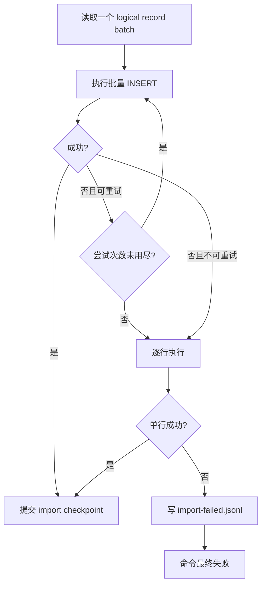

# 08. Graph 数据导入与失败重试软件实现设计

> 状态：软件实现设计，未开始编码。
> 导入使用 nebula-java 连接目标 graphd 并执行 nGQL `INSERT VERTEX/EDGE`。不使用 Nebula Importer、Spark 或 Flink。

## 1. 目标与边界

在目标空集群上先重建元数据，再把完成判定通过的 CSV/JSON 数据文件解析为批量 INSERT。导入应支持中断恢复、批次重试、单行降级、失败记录与单独 `retry-failed` 命令。

同 key 同值的重复 INSERT 被接受，依赖目标空集群避免同 key 不同值覆盖。若 schema/index 或数据导入最终失败，脚本退出，用户手动清理目标；工具绝不自动 DROP。

## 2. 源码依据

| 来源 | 关键位置 | 设计结论 |
| --- | --- | --- |
| nebula-java | `graph/net/Session.java:85-150` | `Session.execute` 可以执行任意 nGQL，并在连接中断时按 Session 配置重连。 |
| nebula-java | `graph/data/ResultSet.java:144-184,284-295` | 导入必须同时处理抛出的 I/O 异常和 `ResultSet.isSucceeded()==false` 的服务端失败。 |
| nebula-java | `graph/SessionPool.java:159-201` | 原客户端将语法/语义错误视为非重试结果；迁移错误分类遵循这一原则。 |
| nebula-java | `client/src/main/generated/com/vesoft/nebula/ErrorCode.java:17-62` | 可识别连接、leader、语法、语义、执行等错误码，形成 retryable/non-retryable 分类。 |
| Nebula Graph 3.6 | `/home/sch/nebula/nebula-3.6-io/src/parser/parser.yy:2920-3015` | 服务端原生解析 `INSERT VERTEX` 和 `INSERT EDGE`，并支持属性列列表。 |
| Nebula Graph 3.6 | `src/parser/parser.yy:2149-2167` | edge key 固定为 `src -> dst @ rank`，rank 必须从文件 key 恢复。 |
| Nebula Graph 3.6 | `src/graph/validator/MutateValidator.cpp` | INSERT 在 graph validator 中进行 schema/value 校验；本地 renderer 必须以 snapshot schema 渲染 typed literal。 |

## 3. 包与执行模型

```text
com.vesoft.nebula.migration.importer
  ImportCommand, DataImporter, ImportPlanner, FileImportTask
  MigrationRowReader, BatchAssembler, NgqlBatchRenderer
  GraphBatchExecutor, ImportRetryPolicy, GraphErrorClassifier
  SingleRowFallback, FailedRecordWriter, RetryFailedCommand
```

`DataImporter` 由 01 的 `import` 命令驱动，顺序执行：完整性验证 -> 目标 precheck -> 04 元数据重建 -> 数据文件导入 -> import report。数据文件 worker 使用 02 模块的独占 `GraphSessionLease`，不共享同一 Session。

第一版新增静态参数 `import.concurrent.workers`，默认 `1`。默认保守是因为用户只确定批次/重试参数且目标集群需要防止 OOM；性能测试证明安全后可调大，不支持运行中热更新。

## 4. 导入前置条件

1. manifest 处于 `EXPORTED` 或可恢复的 import 失败状态，metadata snapshot 和所有待导入文件通过 05 的 SHA/signature 检查。
2. target precheck 证明仅有 root 且无业务 space。
3. 04 模块已完成 `CREATE SPACE -> schema -> native index -> non-root user -> role`，并将 metadata state 置为 `COMPLETED`。
4. 文件 schema hash 与当前 metadata snapshot 一致；不一致时拒绝导入，不能用当前 schema 猜测列类型。

## 5. 批次组装与 nGQL 渲染

文件天然只包含一个 space/kind/label，`BatchAssembler` 再按最大记录数切批：

```properties
import.batch.vertices=500
import.batch.edges=500
import.retry.max-attempts=3
import.retry.backoff.ms=1000
```

渲染结果示意：

```ngql
USE basketballplayer;
INSERT VERTEX `player`(`name`,`age`) VALUES "player100":("Tim Duncan",42), "player101":("Tony Parker",40);

INSERT EDGE `follow`(`degree`) VALUES "player100"->"player101"@0:(95), "player101"->"player100"@0:(90);
```

`NgqlBatchRenderer` 的规则：

1. 标识符以反引号转义，string/VID 字面量使用严格 nGQL string escaping；不接受来自数据文件的原始 nGQL 片段。
2. 整数 VID 不加引号，字符串 VID 使用字符串字面量；`_rank` 固定为有符号整数。
3. 属性列顺序严格使用 snapshot；NULL 输出 `NULL`，浮点/日期/时间/地理值调用 05 的 typed literal renderer。
4. 每条 nGQL 的估算字节数受 `import.max-ngql-bytes` 静态上限保护；即使不足 500 行也提前封批，防止超过 graph 的 query size 限制。
5. 每个 worker 在第一次处理某 space 或 space 切换时显式 `USE <space>`，并检查结果后再执行 INSERT。

## 6. 重试和单行降级



分类规则：`IOErrorException`、`E_DISCONNECTED`、`E_FAIL_TO_CONNECT`、`E_RPC_FAILURE`、`E_LEADER_CHANGED` 和经验证的瞬时 `E_EXECUTION_ERROR` 可批次重试；`E_SYNTAX_ERROR`、`E_SEMANTIC_ERROR`、schema/space/权限错误不可反复批次重试，直接进入单行诊断。即使批次最终失败，单行仍按同一 retry policy 运行，成功行计入 checkpoint，最终失败行写审计文件。

每次退避使用固定 `import.retry.backoff.ms`，不做运行时调速。重试前重新获取 session lease；08 模块不依赖 SessionPool 的隐式 query retry，确保报告中的 `attempts` 与真实业务执行次数对应。

## 7. Checkpoint、幂等与 retry-failed

07 模块在一个 batch 中所有行已有确定处理结果后推进 `logicalRecordNumber`。发生网络超时但服务端是否已写入未知时，checkpoint 可以落后；重启会重放该 batch。由于目标预检为空，且用户接受同 key 同值覆盖，重放是允许的；不同值覆盖不作为冲突解决机制。

`import-failed.jsonl` 包含原始 logical record、文件、record number、row key、渲染 nGQL、error code/message、attempts。`retry-failed` 只读取最终失败记录，按当前 metadata snapshot 再渲染和执行；它写 `retry-failed.jsonl` 和新的 import report，不删除历史失败文件。只要仍存在最终失败记录，任务 state 不得为 `IMPORTED`，命令返回退出码 7。

## 8. 资源与可观测性

每个 worker 只持有当前 batch 的 `MigrationRow`、nGQL 字符串和一条 Session；文件 reader 流式读取。日志按文件/record range/batch id 输出，失败日志写 nGQL 摘要并可在受限失败文件中保留完整语句。指标包括 rows/sec、batches、retry count、single-row fallback count、success/failure rows、每类 error code 和 checkpoint 延迟。

## 9. 测试与完成准则

单元测试覆盖 CSV/JSON reader 到批次、identifier/string escaping、VID/rank/null/float/time renderer、大小封批、错误分类、重试次数、checkpoint 落后重放、单行 fallback 和 failure record。集成测试覆盖 schema/index 前置顺序、500 批次、目标 graphd 短暂故障、错误数据混入一个批次、kill import、retry-failed、目标非空阻断。

完成标准：正常文件仅使用 graph `INSERT VERTEX/EDGE` 即可恢复点边；任一不确定批次可安全重放；最终失败不会被静默跳过；schema/index 失败或目标非空时工具不进行自动清理。
