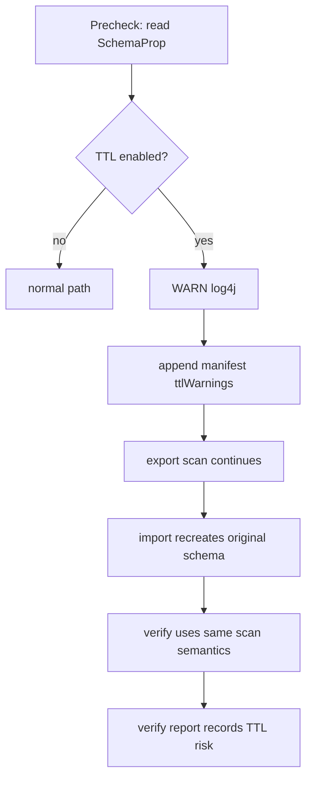

# 10. TTL 识别与迁移风险处理软件实现设计

> 状态：软件实现设计，未开始编码。
> TTL 不阻断迁移，也不改变默认 count/sample 校验标准；它必须被检测、告警并写入 manifest/report。数据冻结不会冻结系统时间。

## 1. 源码结论

TTL 不仅在 auto compaction 时才生效。Nebula Graph 3.6 源码表明 storage 读取和 scan 路径会主动过滤过期数据，compaction 负责物理清理：

| 来源 | 关键位置 | 结论 |
| --- | --- | --- |
| Nebula Graph 3.6 | `/home/sch/nebula/nebula-3.6-io/src/storage/CommonUtils.cpp:38-81` | `checkDataExpiredForTTL` 基于当前时间、TTL duration 和 TTL 列值判断过期；`ttlProps` 仅在 duration>0 且 ttl column 非空时启用。 |
| Nebula Graph 3.6 | `src/storage/exec/TagNode.h:142-151` | TagNode 构造 reader 后发现 TTL 过期会 reset reader，使该 tag row 无效。 |
| Nebula Graph 3.6 | `src/storage/exec/EdgeNode.h:161-170` | EdgeNode 使用相同逻辑使过期 edge 无效。 |
| Nebula Graph 3.6 | `src/storage/exec/StorageIterator.h:85,138-151` | storage iterator 也拥有 TTL 检查路径。 |
| Nebula Graph 3.6 | `src/storage/exec/ScanNode.h:72-180` | `StorageClient.scanVertex/scanEdge` 对应 scan node 的 read path，因此看不到已过期数据。 |
| Nebula Graph 3.6 | `src/storage/StorageServer.cpp:101-106` | storage server 配置 `StorageCompactionFilterFactoryBuilder`，这是过期数据物理清理路径。 |
| Nebula Graph 3.6 | `src/meta/MetaServiceUtils.cpp:162-210` | TTL column 必须存在且类型为 INT64/TIMESTAMP；已有 index 时改变 TTL 受到约束。 |
| nebula-java | `client/src/main/generated/com/vesoft/nebula/meta/SchemaProp.java:29-34,135-173` | 当前 Java 生成类型直接暴露 `ttl_duration` 和 `ttl_col`，可在不解析 DDL 文本的情况下探测 TTL。 |
| nebula-java | `meta/MetaClient.java:297-326,371-400` | `getTag/getEdge` 返回 Schema，是 TTL probe 的结构化输入。 |

## 2. 目标与边界

`TtlSchemaProbe` 在 precheck 和 export metadata snapshot 阶段检查每个 tag/edge 的 schema prop。TTL 存在时：

1. 使用 log4j WARN 输出 space、kind、label、ttl column、duration 和风险说明。
2. 在 `manifest.json.ttlWarnings`、`export-report.json`、`verify-report.json` 写结构化标记。
3. 继续 export/import/verify；不跳过该 label，不降低校验要求。

本模块不冻结时间、不尝试延长/关闭 TTL、不触发 compaction、不重写导出行 TTL 值，也不把风险当作 count/sample 失败的豁免。

## 3. 数据模型与包设计

```text
com.vesoft.nebula.migration.ttl
  TtlSchemaProbe, TtlWarning, TtlWarningCollector
  TtlRiskEvaluator, TtlReportAppender
```

```json
{
  "space": "basketballplayer",
  "kind": "VERTEX",
  "label": "player",
  "ttlColumn": "expire_at",
  "ttlDuration": 3600,
  "detectedAt": "2026-07-10T...Z",
  "scanFiltersExpiredRows": true,
  "risk": "CLOCK_ADVANCES_DURING_MIGRATION"
}
```

`TtlSchemaProbe` 以 `Schema.getSchema_prop()` 读取 `SchemaProp`，判定条件为：`ttl_duration > 0`、`ttl_col` 已设置且 UTF-8 解码后非空。它还验证 ttl column 在 snapshot columns 中存在，并记录其类型；异常 schema 作为 precheck FAIL（schema 无法可靠导出），而有效 TTL schema 仅 WARN。

## 4. 生命周期中的处理



关键时序：

1. 源端在 export 期间被冻结，阻止业务写入，但当前时间继续推进。export scan 已经忽略开始扫描前过期的 row。
2. 仍可有 row 在某个 source partition 已扫描后、其他 partition 扫描前过期；冻结无法防止该可见性变化。
3. 目标在 metadata 导入时先创建原 TTL schema，再写入行。一个在导出时可见、但导入时已按其 ttl column 到期的 row，可能在目标 scan/查询中立即不可见。
4. 默认验证不因 TTL 改变规则，故可能真实报告 count/sample FAIL；报告必须同时给出 `ttlAffected=true`，不能把差异掩盖为成功。

测试阶段若要求“目标与当前源一致”，TTL 测试数据的到期时间必须覆盖 export + import + verify 的完整窗口。生产阶段只验证目标与 export snapshot 的关系，但同样应在报告中保留 TTL 风险，避免把时间相关差异误解为文件损坏。

## 5. 与其他模块的接口

| 消费者 | 输入/行为 |
| --- | --- |
| 03 Precheck | `List<TtlWarning>` -> WARN check result，不阻断。 |
| 04 Metadata | schema snapshot 保存 TTL prop，确保目标创建 DDL 不丢失 TTL。 |
| 06 Export | 每个 export unit 标记 `ttlAffected`；不改变 scan 参数。 |
| 07 State/Report | manifest/report 追加 warning，记录首次/末次观察时间。 |
| 09 Verify | 每个 verification result 继承 `ttlAffected`，报告可解释时间风险但不豁免 FAIL。 |
| 11 Tests | 构造长 TTL、迁移中到期、已到期和无 TTL 四类数据。 |

## 6. 日志与告警

日志模板固定，不输出业务 row 值：

```text
WARN TTL_SCHEMA_DETECTED jobId={} space={} kind={} label={} ttlColumn={} ttlDuration={} \
scanFiltersExpiredRows=true risk=CLOCK_ADVANCES_DURING_MIGRATION
```

同一 `(space,kind,label,ttlColumn,ttlDuration)` 只在 precheck 和 export 开始各记录一次，避免 page 级日志洪泛。报告中追加 `ttlWarningCount` 和所有对象清单。

## 7. 测试与完成准则

单元测试覆盖 SchemaProp 的 duration/column 组合、byte[] UTF-8 decode、无效 TTL column、tag/edge 两类、warning 去重和 manifest serialization。集成测试验证：已过期 row 不被 StorageClient scan 导出；未过期 row 正常导出；导入/verify 期间到期触发差异并保留 TTL 标记；无 TTL 场景无 warning。

完成标准：工具能基于实际 `SchemaProp` 稳定识别 TTL，并明确记录“read path filters expired rows，冻结不冻结时间”的风险；TTL 不会导致数据被静默跳过或校验结果被弱化。
