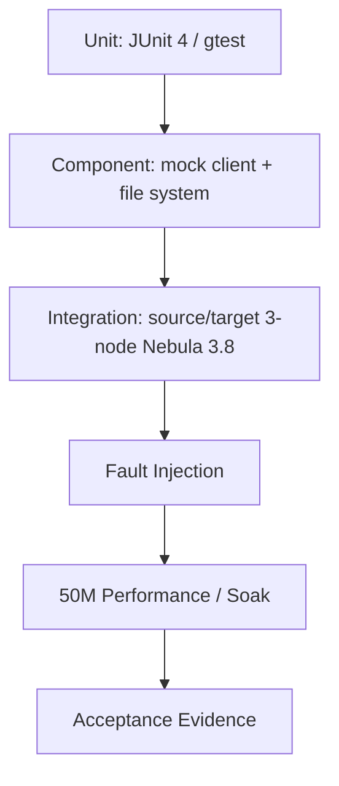

# 11. 测试、故障注入与性能验收软件实现设计

> 状态：软件实现设计，未开始编码。
> 本文定义 01-10 的测试策略和验收证据，不等同于测试代码实现。测试运行时基线是 Nebula Graph 3.8 的源/目标三实例集群；3.6 源码用于理解内核行为和选择覆盖点。

## 1. 目标与质量门槛

测试必须证明以下结果：

1. 源集群被冻结后，工具能把逻辑元数据和可见点边导出为可审计 artifact。
2. 空目标集群可按既定顺序重建 metadata，并仅通过 nGQL INSERT 导入数据。
3. 进程、连接、leader、文件和批次故障不会造成“误报完成”或未记录数据丢失。
4. 默认 count + sample 校验准确；开启 full checksum 时能发现全量属性差异。
5. 工具在 5000 万级测试数据上产生完整性能/资源证据，并为最大 20 亿点边、12 space 的生产调优提供参数边界。

## 2. 源码依据

| 来源 | 关键位置 | 对测试设计的启示 |
| --- | --- | --- |
| nebula-java | `client/src/test/java/com/vesoft/nebula/client/storage/StorageClientTest.java:32-379` | 已有 MockStorageData、vertex/edge scan、columns、SSL 测试模式；迁移单测/组件测试沿用 JUnit 4。 |
| nebula-java | `client/src/test/java/com/vesoft/nebula/client/meta/TestMetaClient.java:36-190` | 现有测试覆盖 meta 连通、space/tag/edge/parts 和 storage host 上下线，可扩展为 precheck 故障场景。 |
| nebula-java | `client/src/test/java/com/vesoft/nebula/client/graph/net/TestSession.java` | 现有测试覆盖多 graphd、连接重连和并发 Session 使用，是 graph adapter/导入故障注入基线。 |
| Nebula Graph 3.6 | `/home/sch/nebula/nebula-3.6-io/src/graph/validator/test/MutateValidatorTest.cpp` | 冻结内核的 DML 拦截测试应在 mutation validator 测试体系中增加。 |
| Nebula Graph 3.6 | `src/graph/validator/test/ACLValidatorTest.cpp`、`AdminValidatorTest.cpp` | ACL 与 Admin Job 冻结分类必须单独覆盖，不能只测 INSERT。 |
| Nebula Graph 3.6 | `src/parser/test/ParserTest.cpp:3103-3109` | SHOW/STOP/RECOVER JOB 的允许/拒绝语义有既有 parser 基线。 |
| Nebula Graph 3.6 | `src/graph/service/test/StandAloneTestGraphFlags.cpp` | 新 `enable_graph_mutation` gflag 需要 standalone flag 注册和 mutable 配置测试。 |
| Nebula Graph 3.6 | `src/storage/exec/TagNode.h`、`EdgeNode.h`、`StorageIterator.h` | TTL 测试必须在 scan/read 路径验证可见性，而不能只依赖 compaction 触发。 |

## 3. 测试分层



| 层级 | 范围 | 运行频率 | 不依赖项 |
| --- | --- | --- | --- |
| Unit | 编解码、配置、状态机、renderer、hash、错误分类 | 每次构建 | 不需要 Nebula 服务 |
| Component | adapter mock、文件完成、checkpoint、scan page 消费 | 每次合并 | 不需要生产级集群 |
| Integration | 源/目标 3 graphd + 3 metad + 3 storaged、真实 scan/INSERT | 每日或发布候选 | 不使用人工脚本判定结果 |
| Fault injection | kill/restart/corrupt/leader/network | 发布候选 | 不与性能压测并发 |
| Performance | 50M 级数据、不同布局和并发 | 专用环境 | 不进入常规 CI |

## 4. 环境拓扑

每个集群最少：3 graphd、3 metad、3 storaged；源和目标完全隔离，均为 Nebula Graph 3.8。源集群部署已完成的 graphd 数据静止能力，所有 graphd 都暴露 `GET /migration_freeze_status`。目标初始仅 root 用户且无业务 space。

测试配置按以下三组管理：

```text
test/conf/unit.properties              本地临时目录，不含网络地址
test/conf/integration-label.properties source/target，CSV + label
test/conf/integration-partition.properties source/target，JSON/CSV + partition
test/conf/performance.properties       50M 专用目录与资源限制
```

密码从受控测试环境变量注入，不提交到仓库或报告。测试任务目录必须相互隔离，避免 checkpoint 和 manifest 串扰。

## 5. 逻辑数据集

优先选择可合法分发的开源图数据集扩展到约 5000 万点边；如果它不能覆盖以下维度，构造补充数据集并记录生成脚本和随机种子：

| 维度 | 最小覆盖 |
| --- | --- |
| space | 至少 3 个；包含一个整数 VID space 和一个固定字符串 VID space。 |
| schema | 每 space 多 tag、多 edge、多个 native tag/edge index、含 TTL 和无 TTL label。 |
| ACL | root、至少两个非 root 用户、跨多个 space 的合法角色授权。 |
| 类型 | BOOL、INT、FLOAT/DOUBLE、STRING、DATE、TIME、DATETIME、NULL、空字符串、转义引号、逗号、换行、反斜杠和 UTF-8。 |
| edge key | 同 src/dst 多 rank，双向 edge，空属性 edge。 |
| TTL | 已过期、迁移窗口内不过期、导出后/导入前到期三类。 |
| 规模 | 单元/集成小集；性能约 50M 点边；生产容量建模到 20 亿点边、12 space。 |

生成器不得使用 Spark/Flink/Nebula Importer；可通过 nebula-java/graph nGQL 分批写入测试数据，生成器本身也要记录 batch/retry 行为，避免数据集创建成为不可复现黑盒。

## 6. 模块测试矩阵

| 模块 | 关键测试 |
| --- | --- |
| 01 工程/配置 | Java 8 构建、命令路由、默认值、未知 key、敏感脱敏、workspace lock、退出码。 |
| 02 连接适配 | 多 graphd/meta 地址、首 meta 地址不可用、TLS、storage leader 改变、资源关闭、一个 StorageClient 多 partition iterator。 |
| 03 Precheck/冻结 | 3 graphd 全部 frozen 才通过；DML/DDL/ACL/ADD JOB 被拒；SHOW/STOP JOB 允许；in-flight mutation drain；任一未冻结阻断。 |
| 04 Metadata | show-create snapshot、space/tag/edge/index 重建顺序、root 仅审计、默认密码、space 角色、全文索引/扩展权限报告。 |
| 05 格式/完整性 | CSV/JSON 往返、NULL/`\\N`、空字符串、浮点 raw bits、日期时间、UTF-8、checksum/HMAC、tmp/corrupt/signature failure。 |
| 06 Export | label/partition、cursor 多 page、all-success 检查、per-part stats、背压、kill 后恢复、删除 sig 后重导。 |
| 07 状态/报告 | 状态迁移、manifest backup、并发事件、CSV 多行 record checkpoint、failure JSONL、报告中无敏感信息。 |
| 08 Import | 500 行 batch、nGQL 转义、批次 retry、单行 fallback、checkpoint 重放、最终失败退出、retry-failed。 |
| 09 Verify | per-part count、最小确定性样本、sample mismatch、full checksum on/off、关闭时固定声明。 |
| 10 TTL | SchemaProp 探测、WARN/manifest/report、scan 过滤已过期、迁移过程中到期不被豁免。 |

## 7. 端到端验收场景

| 编号 | 场景 | 预期结果 |
| --- | --- | --- |
| E2E-01 | CSV + label 完整迁移 | metadata、数据文件、签名、导入、count/sample 全通过。 |
| E2E-02 | CSV + partition 完整迁移 | 每个 partition 可独立跳过/恢复，结果全通过。 |
| E2E-03 | JSON + label/partition | typed JSON round-trip 与 CSV 同等校验结果。 |
| E2E-04 | 目标已有业务 space | import 在 metadata 前退出，无自动 DROP。 |
| E2E-05 | 目标已有非 root user | import 阻断，无任何目标修改。 |
| E2E-06 | metadata/index 创建故障 | 导入退出并给出人工清理提示。 |
| E2E-07 | 一批含坏 row | 其他行经单行降级导入，坏 row 落 `import-failed.jsonl`，任务失败。 |
| E2E-08 | retry-failed 修复后重试 | 历史 failure 保留，新 retry 报告显示成功/残留。 |
| E2E-09 | count 相同但抽样属性不同 | verify FAIL。 |
| E2E-10 | full checksum 开启且一行未被采样的属性不同 | verify FAIL。 |
| E2E-11 | TTL 在迁移窗口内到期 | report 有 TTL 风险，默认规则照常判定结果。 |
| E2E-12 | source 未冻结或 RUNNING COMPACT/BALANCE/REBUILD job | export precheck FAIL。 |

## 8. 故障注入

故障注入必须保存注入时刻、命令、进程状态、manifest 前后版本和恢复结果。每次只注入一种主故障，避免无法归因。

| 故障 | 注入点 | 验收 |
| --- | --- | --- |
| kill export JVM | label writer 写入中、partition 文件写入中 | label 整体重导；已签名 partition 跳过；无未完成文件被导入。 |
| kill import JVM | batch 执行前后、checkpoint 写入前 | 可重放，最终无未记录失败。 |
| 删除/篡改 artifact | `.sig`、`.sha256`、数据文件 | 完整性检查失败，禁止 import/skip。 |
| graphd restart | metadata/INSERT 中 | Session reconnect/工具 retry 正确计数。 |
| storaged restart / leader change | scan/verify 中 | nebula-java leader refresh 后继续，或安全整体重扫 partition。 |
| meta leader change | connect/metadata 读取中 | adapter 返回可恢复或明确失败。 |
| 网络短断 | source/target graph 与 storage | 不产生虚假 COMPLETED。 |
| schema failure | 创建 tag/index 时 | 退出码 6，无自动清理。 |
| freeze race | 设置冻结时有 in-flight mutation | status 只有 active count 归零才 FROZEN。 |

## 9. 性能、资源与稳定性测试

性能环境使用 50M 左右点边数据，分别执行 CSV-label、CSV-partition、JSON-label、JSON-partition。每组至少重复三次，记录 P50/P95 速度，不只记录单次最佳值。

必须采集：

1. export/import/verify 行数每秒、文件数、重试数、恢复耗时。
2. 每个 graphd/metad/storaged 的 CPU、RSS、GC、网络、磁盘吞吐与磁盘空间。
3. 工具 JVM heap、GC pause、queue 峰值、open files、线程数和 checkpoint 延迟。
4. source/target partition 分布、leader 变化和 TTL warning 数。
5. label 单文件大小与 partition 文件分布，作为生产布局选择依据。

试验矩阵从默认 `scan.limit=1000`、partition concurrency `8`、label concurrency `1`、import batch `500`、retry `3/1000ms` 开始，只允许在下一轮启动前修改静态参数。出现 OOM、长 GC、storage 延迟恶化或业务资源阈值超过时，降低并发或 batch；不在运行中调参。

## 10. 发布验收证据

一个发布候选必须归档以下证据：

```text
test-evidence/<build-id>/
  source-freeze-status.json
  precheck-report.json
  export-report.json
  import-report.json
  verify-report-default.json
  verify-report-full-checksum.json
  failure-injection-summary.json
  performance-summary.json
  environment-inventory.json
  test-data-manifest.json
```

验收结论分为 `PASS`、`PASS_WITH_TTL_WARNING`、`FAIL`。默认验收通过不等于全量属性证明：除非 `verify-report-full-checksum.json` 为 PASS，发布记录必须保留“未证明全量完全一致”的限定。

## 11. 完成准则

代码开发可在以下条件满足后进入生产试点：01-10 对应单元与集成测试通过；label/partition、CSV/JSON 全链路通过；所有故障注入均可安全恢复或明确失败；冻结内核三 graphd 证明一致；50M 性能报告无 OOM 且有资源/速度基线；全量 checksum 的顺序稳定性已在真实 3.8 集群验证。
