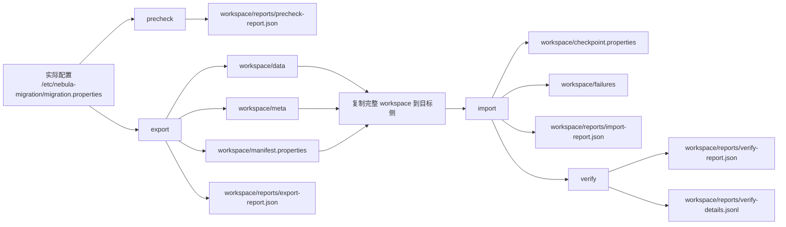

# Nebula Graph 搬迁工具产品目录与运行文件使用说明

## 1. 读者与适用范围

本文解释 [产品化发行目录设计](product-release-directory-design.md) 第 4、5、6 节中每个目录和文件的用途、创建方、使用时机与保留要求。

目录设计分为三层，不能混用：

```text
发行包：程序和文档，只读，不保存任务状态
    /opt/nebula-migration/<version>

运行配置：真实地址、账号、JVM 和日志策略，受权限保护
    /etc/nebula-migration

任务 workspace：导出数据、签名、manifest、checkpoint、报告和任务日志
    /var/lib/nebula-migration/jobs/<job-id>
```

当前开发版已经实现了 workspace 内的 `data`、`meta`、`reports`、`failures`、`logs`、manifest 和 checkpoint 结构。`/opt`、`/etc`、`/var/log` 的产品化安装布局及外部 log4j 覆盖是后续发布包装需要完成的适配。

## 2. 发行包目录：解压后如何使用

发行包文件名建议为：

```text
nebula-migration-1.0.0-linux-x86_64.tar.gz
```

解压后得到一个带版本号、不可变的目录：

```text
nebula-migration-1.0.0/
├── bin/
├── lib/
├── conf/
├── examples/
├── scripts/
├── docs/
├── licenses/
├── checksums/
├── VERSION
├── RELEASE_NOTES.md
└── manifest.json
```

该目录只用于运行程序和阅读随包文档。不要在其中保存真实 `migration.properties`、导出文件、任务报告或日志；这些文件必须放在第 3、4 节定义的外部目录。

### 2.1 `bin/`：用户启动入口

```text
bin/
├── nebula-migration
└── nebula-migration-env
```

| 文件 | 创建方 | 用途 | 使用方式 |
| --- | --- | --- | --- |
| `nebula-migration` | 发布包 | 唯一稳定的用户命令入口；定位 Jar、读取 JVM 参数并启动 Java CLI | 直接执行，例如 `bin/nebula-migration export -c /etc/nebula-migration/migration.properties` |
| `nebula-migration-env` | 发布包 | 被主启动脚本加载的内部环境脚本，统一处理 `JAVA_HOME`、`JAVA_OPTS`、安装路径和配置路径 | 不建议用户单独执行或修改 |

用户只需要调用 `nebula-migration`。它支持如下子命令：

```bash
bin/nebula-migration precheck -c /etc/nebula-migration/migration.properties
bin/nebula-migration export -c /etc/nebula-migration/migration.properties
bin/nebula-migration import -c /etc/nebula-migration/migration.properties
bin/nebula-migration retry-failed -c /etc/nebula-migration/migration.properties
bin/nebula-migration verify -c /etc/nebula-migration/migration.properties
```

`bin/` 不产生任务数据。其角色只是启动器，因此升级时可随产品版本整体替换。

### 2.2 `lib/`：Java 运行程序

```text
lib/
└── nebula-migration.jar
```

`nebula-migration.jar` 是 Maven shade 生成的可执行 Jar，包含迁移工具代码、nebula-java、log4j 和其他运行依赖。`bin/nebula-migration` 应固定引用此文件，而不能引用开发目录下的 `target/nebula-migration-<version>.jar`。

使用规则：

1. 不手工替换 Jar 内的类文件或依赖。
2. 不在运行机器上执行 Maven 构建。
3. Jar 损坏或版本不匹配时，重新安装完整发行包，并先执行 `scripts/verify-release.sh`。
4. Jar 版本由安装目录名、`VERSION` 和 `manifest.json` 共同确认。

### 2.3 `conf/`：只读模板，不放真实密码

```text
conf/
├── migration.properties.example
├── log4j.properties
└── jvm.options.example
```

| 文件 | 内容 | 正确使用方式 | 禁止事项 |
| --- | --- | --- | --- |
| `migration.properties.example` | 源/目标地址、并发、格式、布局、workspace 等参数模板 | 复制到 `/etc/nebula-migration/migration.properties` 后填写实际值 | 不在包内直接填写账号密码；不提交真实配置到 Git |
| `log4j.properties` | 默认日志级别、格式和输出规则 | 复制到 `/etc/nebula-migration/log4j.properties` 后按环境调整 | 不把业务数据或密码写入日志 pattern |
| `jvm.options.example` | `-Xms`、`-Xmx`、GC 等 JVM 参数模板 | 复制到 `/etc/nebula-migration/jvm.options` 后按主机资源调整 | 不直接修改包内模板；不设置超出主机可用内存的堆 |

推荐的初始化方式：

```bash
install -d -m 0750 -o root -g nebula /etc/nebula-migration
install -m 0640 -o root -g nebula \
  /opt/nebula-migration/current/conf/migration.properties.example \
  /etc/nebula-migration/migration.properties
install -m 0640 -o root -g nebula \
  /opt/nebula-migration/current/conf/jvm.options.example \
  /etc/nebula-migration/jvm.options
install -m 0640 -o root -g nebula \
  /opt/nebula-migration/current/conf/log4j.properties \
  /etc/nebula-migration/log4j.properties
```

真实配置中的 `workspace` 应指向任务目录，例如：

```properties
workspace=/var/lib/nebula-migration/jobs/migration-20260717-001
```

### 2.4 `examples/`：可复制的参数样例

```text
examples/
├── csv-label.properties
├── json-partition.properties
└── expected-workspace-tree.txt
```

| 文件 | 用途 | 使用方式 |
| --- | --- | --- |
| `csv-label.properties` | 默认 CSV + `label` 布局的示例 | 作为实际 properties 的参数参考；修改地址、账号和 workspace 后再使用 |
| `json-partition.properties` | JSON Lines + `partition` 布局的示例 | 用于验证分区级文件、分区级断点恢复和高并发导入 |
| `expected-workspace-tree.txt` | 正常任务完成后 workspace 的目录样例 | 与实际任务目录对照，确认缺失的签名、报告或 checkpoint |

样例中的 IP、用户、密码和路径均为示例值，不能直接用于生产。

### 2.5 `scripts/`：安装与支持辅助脚本

```text
scripts/
├── validate-install.sh
├── collect-support-bundle.sh
└── verify-release.sh
```

| 脚本 | 使用时机 | 输入 | 输出 | 注意事项 |
| --- | --- | --- | --- | --- |
| `validate-install.sh` | 首次安装、升级和回滚后 | 安装目录、JDK、配置目录 | 环境检查结果 | 只检查，不创建或删除搬迁数据 |
| `collect-support-bundle.sh` | 工具失败、需要支持诊断时 | job ID 或 workspace | 脱敏的日志、manifest、报告和配置摘要压缩包 | 默认不复制 `data/`，避免泄露大体量业务数据 |
| `verify-release.sh` | 下载发行包后、安装前 | `checksums/SHA256SUMS` 和包内文件 | 校验通过/失败状态 | 仅校验产品包，不替代任务 artifact 的 `.sha256`/`.sig` 校验 |

示例：

```bash
/opt/nebula-migration/current/scripts/verify-release.sh
/opt/nebula-migration/current/scripts/validate-install.sh \
  -c /etc/nebula-migration/migration.properties
/opt/nebula-migration/current/scripts/collect-support-bundle.sh \
  --workspace /var/lib/nebula-migration/jobs/migration-20260717-001
```

### 2.6 `docs/`：离线使用资料

```text
docs/
├── user-guide.md
├── code-walkthrough.md
├── external-validation-checklist.md
├── compatibility.md
└── upgrade-and-rollback.md
```

| 文件 | 阅读时机 |
| --- | --- |
| `user-guide.md` | 首次执行迁移前，确认命令、配置、恢复和报告含义 |
| `code-walkthrough.md` | 开发、故障定位、代码评审时，了解实现模块和数据流 |
| `external-validation-checklist.md` | 在其他环境做功能、恢复和性能验收时逐项记录证据 |
| `compatibility.md` | 安装、升级前确认 Java、nebula-java、Nebula Graph 服务端版本矩阵 |
| `upgrade-and-rollback.md` | 产品升级、回滚和处理未完成任务前 |

文档是发行包的一部分，保证离线环境也能查阅，但文档本身不参与任务状态恢复。

### 2.7 `licenses/`：许可证和第三方声明

```text
licenses/
├── LICENSE
├── NOTICE
└── third-party-notices/
```

| 路径 | 内容 | 使用方式 |
| --- | --- | --- |
| `LICENSE` | 产品许可证正文 | 交付、审计和法务核查 |
| `NOTICE` | 产品通知和版权声明 | 与许可证一同交付 |
| `third-party-notices/` | nebula-java、log4j 等三方组件的许可证和声明 | 商业交付合规审查 |

这些文件不影响运行，但必须随发行包保留，不能在二次打包时删除。

### 2.8 `checksums/`：发行包完整性

```text
checksums/
├── SHA256SUMS
└── SHA256SUMS.asc
```

| 文件 | 含义 | 使用方式 |
| --- | --- | --- |
| `SHA256SUMS` | 包内关键文件的 SHA-256 清单 | 由 `verify-release.sh` 或 `sha256sum -c` 校验发行包完整性 |
| `SHA256SUMS.asc` | 对 SHA-256 清单的发布签名 | 发布方提供受信任公钥时，先校验签名，再校验 SHA-256 |

这是“产品包完整性”机制。搬迁数据文件的完整性由 workspace 中每个 artifact 的 `.sha256` 和 `.sig` 负责，两者用途不同，不能互相替代。

### 2.9 顶层文件

| 文件 | 内容 | 使用方式 |
| --- | --- | --- |
| `VERSION` | 产品语义版本，例如 `1.0.0` | 安装、支持和升级时快速确认版本 |
| `RELEASE_NOTES.md` | 新功能、修复、兼容性变化、升级限制和已知问题 | 升级前必读，尤其关注未完成任务兼容性 |
| `manifest.json` | 产品名、版本、Git commit、构建时间、Java/Nebula 兼容矩阵、Jar 摘要 | 自动化安装验证、问题追溯、支持工单证据 |

## 3. 安装后的固定目录：配置、版本与启动日志

产品安装后使用四个固定路径：

```text
/opt/nebula-migration/                 # 产品程序
/etc/nebula-migration/                 # 实际配置和凭证
/var/lib/nebula-migration/jobs/        # 每个任务的 workspace
/var/log/nebula-migration/             # 启动器和安装诊断日志
```

### 3.1 `/opt/nebula-migration/`：版本化、不可变的安装目录

```text
/opt/nebula-migration/
├── 1.0.0/
├── 1.1.0/
└── current -> 1.1.0
```

| 路径 | 含义 | 如何使用 |
| --- | --- | --- |
| `/opt/nebula-migration/1.0.0/` | 已安装的旧产品版本 | 保留到没有任何未完成任务依赖该版本后再删除 |
| `/opt/nebula-migration/1.1.0/` | 新产品版本 | 完整解压新包、校验并完成小规模验证后使用 |
| `/opt/nebula-migration/current` | 当前默认产品版本的软链接 | 所有运维命令固定使用此路径；升级或回滚时原子切换软链接 |

推荐执行命令：

```bash
/opt/nebula-migration/current/bin/nebula-migration \
  export -c /etc/nebula-migration/migration.properties
```

不能将 `current` 指向一个正在被删除、半解压或未完成校验的目录。升级不会覆盖旧版本；回滚只需将 `current` 切回已验证的旧版本。

### 3.2 `/etc/nebula-migration/`：真实配置和凭证

```text
/etc/nebula-migration/
├── migration.properties
├── jvm.options
└── log4j.properties
```

| 文件 | 内容 | 如何使用 | 修改后的生效时间 |
| --- | --- | --- | --- |
| `migration.properties` | 源/目标 cluster 地址、用户密码、workspace、导出、导入、校验参数 | 每条命令通过 `-c` 指向它 | 下次启动命令时生效 |
| `jvm.options` | Java 堆、GC、系统属性等 JVM 参数 | launcher 启动 Java 前读取 | 下次启动命令时生效 |
| `log4j.properties` | 任务日志级别、输出格式和日志文件策略 | Java 初始化 log4j 时读取 | 下次启动命令时生效 |

一个任务使用一份明确的配置副本更便于审计。建议在创建任务时保存脱敏副本：

```text
/var/lib/nebula-migration/jobs/<job-id>/migration.properties.redacted
```

该副本只用于审计，不能作为运行配置，因为密码已被脱敏。

### 3.3 `/var/lib/nebula-migration/jobs/`：任务数据根目录

```text
/var/lib/nebula-migration/jobs/
├── migration-20260717-001/
└── migration-20260717-002/
```

每个目录只属于一个搬迁任务。任务 ID 建议使用时间加序号或 UUID，避免多个源/目标组合共享同一 workspace。

错误示例：

```text
/var/lib/nebula-migration/jobs/default-workspace
```

这种固定名称容易使第二次任务覆盖前一次的 manifest、checkpoint 或失败队列。

正确示例：

```text
/var/lib/nebula-migration/jobs/migration-prod-a-to-prod-b-20260717-001
```

### 3.4 `/var/log/nebula-migration/`：启动器和安装诊断日志

```text
/var/log/nebula-migration/
└── launcher.log
```

`launcher.log` 用于记录 launcher 的环境错误，例如 Java 不存在、Jar 不存在、外部配置文件不可读或安装包校验失败。它不替代任务日志。

任务本身的业务日志始终写入对应 workspace 的 `logs/`，因为任务日志必须和导出数据、manifest 和报告一起归档。

## 4. 单次搬迁任务 workspace：目录、文件与使用方法

假设本次任务配置为：

```properties
workspace=/var/lib/nebula-migration/jobs/migration-20260717-001
export.format=csv
export.file.layout=label
```

完成导出、导入和校验后的目录如下：

```text
/var/lib/nebula-migration/jobs/migration-20260717-001/
├── .workspace.lock
├── manifest.properties
├── manifest.properties.bak
├── checkpoint.properties
├── data/
├── meta/
├── reports/
├── failures/
└── logs/
```

### 4.1 根目录任务状态文件

| 文件 | 创建方 | 内容 | 如何使用 | 保留策略 |
| --- | --- | --- | --- | --- |
| `.workspace.lock` | `Workspace.open` | 操作系统文件锁 | 工具启动时自动获取，阻止同一 workspace 被两个命令同时修改 | 不手工删除；确认没有进程后可由后续命令复用 |
| `manifest.properties` | `Manifest` | 任务 ID、状态、工具/兼容版本、格式、布局、metadata 路径、artifact 列表、行数、摘要、TTL 与审计字段 | `import`、`verify` 和恢复逻辑的主清单 | 长期保留，随 workspace 一起迁移 |
| `manifest.properties.bak` | `Manifest.save` | 写入新 manifest 前的上一版本副本 | manifest 损坏诊断或人工恢复时参考；不能随意替换正式 manifest | 与正式 manifest 一起保留 |
| `checkpoint.properties` | `CheckpointStore` | 每个 artifact 的连续成功导入行数 | 中断后再次 `import` 自动读取；不手工修改 | 直到任务完成和归档后保留 |

`manifest.properties` 是“导出物清单”，`checkpoint.properties` 是“目标导入进度”。二者不能互相替代。

### 4.2 `data/`：点边导出文件与完整性侧车文件

`data/` 保存由源端 Storage scan 导出的 vertex 和 edge 数据。目录层级为：

```text
data/
└── <space>/
    ├── vertex/
    │   └── <tag>...
    └── edge/
        └── <edge-type>...
```

#### 4.2.1 CSV + `label` 布局

```text
data/social/
├── vertex/
│   ├── person.csv
│   ├── person.csv.sha256
│   ├── person.csv.sig
│   ├── post.csv
│   ├── post.csv.sha256
│   └── post.csv.sig
└── edge/
    ├── follows.csv
    ├── follows.csv.sha256
    └── follows.csv.sig
```

| 文件 | 含义 | 如何使用 |
| --- | --- | --- |
| `person.csv` | `social` space 中 `person` tag 的完整导出数据 | 仅由工具读取并导入；可审计查看，但不得编辑 |
| `follows.csv` | `social` space 中 `follows` edge type 的完整导出数据 | 同上 |
| `<artifact>.sha256` | 对同名 CSV 文件计算的 SHA-256 | `import`/`verify` 前自动校验；人工可用 `sha256sum -c` 辅助检查 |
| `<artifact>.sig` | 文件名、字节数、SHA-256、行数、canonical 摘要及 HMAC 完成标记 | 导出恢复和导入前完整性判断；不得编辑、删除或单独复制 |

`label` 布局表示一个 tag 或 edge type 对应一个完整数据文件。某个已签名 label 文件无效时，重新执行 `export` 会重导整个 label。

#### 4.2.2 JSON + `partition` 布局

```text
data/social/
├── vertex/
│   ├── person.part-1.jsonl
│   ├── person.part-1.jsonl.sha256
│   ├── person.part-1.jsonl.sig
│   ├── person.part-2.jsonl
│   ├── person.part-2.jsonl.sha256
│   └── person.part-2.jsonl.sig
└── edge/
    ├── follows.part-1.jsonl
    ├── follows.part-1.jsonl.sha256
    └── follows.part-1.jsonl.sig
```

| 文件模式 | 含义 | 如何使用 |
| --- | --- | --- |
| `<label>.part-<partition>.jsonl` | 一个 tag/edge 在一个 Nebula partition 中的 JSON Lines 导出数据 | 可独立导入、校验和恢复，但仍应连同 manifest 一起保存 |
| `.sha256` | 同一个 partition 数据文件的 SHA-256 | 检查传输或磁盘损坏 |
| `.sig` | 同一个 partition 的完成和恢复元数据 | 已签名 partition 可在重复 export 时复用 |

`partition` 布局的恢复粒度是单 partition：一个 partition 文件损坏时，重跑 `export` 只需重新导出该 partition，其他签名有效的 partition 文件会复用。

#### 4.2.3 CSV 和 JSON 文件的实际编码

| 格式 | 文件扩展名 | 记录形式 | 注意事项 |
| --- | --- | --- | --- |
| CSV | `.csv` | 首行固定为 `kind,key1,key2,rank,properties`，后续每行一条 vertex/edge 记录 | 不是面向 Excel 编辑的业务 CSV；编辑后会破坏签名和类型编码 |
| JSON Lines | `.jsonl` | 一行一个 JSON 对象 | 不是普通业务 JSON；字段内含 typed/Base64 编码 |

两种格式均保留 VID、edge rank、属性类型和特殊字符信息。用户可以只读审计，但不能用文本编辑器改写后再导入。

### 4.3 `meta/`：元数据快照

```text
meta/
├── metadata.statements
├── metadata.statements.sha256
├── metadata.statements.sig
└── metadata.nql
```

| 文件 | 创建方 | 内容 | 如何使用 |
| --- | --- | --- | --- |
| `metadata.statements` | `MetadataService.exportMetadata` | 每行一个 Base64 编码的 nGQL；包含 space、tag、edge、index、非 root 用户和 space 级角色的重建语句 | 供 `import` 机器读取和重放；不手工编辑 |
| `metadata.statements.sha256` | `Integrity.markCompleted` | 元数据机器可读文件的 SHA-256 | 导入前自动验证 |
| `metadata.statements.sig` | `Integrity.markCompleted` | 元数据文件完成标记和 HMAC 签名 | 导入前自动验证；不能删除 |
| `metadata.nql` | `MetadataService.exportMetadata` | 人可读 nGQL 审计文件，含注释和重建语句 | 用于人工审阅、变更留档和问题定位；不作为 import 的输入 |

特别说明：`metadata.nql` 是可读副本；真正的工具输入是 `metadata.statements`。两者都应归档，但不能以手工修改后的 `metadata.nql` 替换 `metadata.statements`。

### 4.4 `reports/`：各阶段结果报告

```text
reports/
├── precheck-report.json
├── export-report.json
├── import-report.json
├── retry-report.json
├── verify-report.json
└── verify-details.jsonl
```

| 文件 | 生成命令 | 主要内容 | 如何使用 |
| --- | --- | --- | --- |
| `precheck-report.json` | `precheck` | 源/目标版本、连接、Storage ONLINE、space/用户条件等前置检查结果 | 未通过时先排除环境问题，不进入 export/import |
| `export-report.json` | `export` | 格式、布局、artifact 数量、TTL 标记、用户/权限审计、排除对象和任务耗时 | 确认导出范围和审计信息 |
| `import-report.json` | `import` | artifact 数量、metadata 是否完成、任务耗时 | 确认数据导入阶段成功结束 |
| `retry-report.json` | `retry-failed` | 成功重试数、失败数、剩余失败队列和状态 | 判断是否仍有无法导入的记录 |
| `verify-report.json` | `verify` | 总体 PASS/FAIL、artifact 数、TTL、全量 checksum 是否启用和是否证明全量一致 | 迁移最终验收结论的主报告 |
| `verify-details.jsonl` | `verify` | 每个 artifact、每个 partition 的期望/实际数量、数量匹配和值匹配结果 | 定位具体 space/tag/edge/partition 差异 |

默认校验只保证数量和确定性样本一致。只有 `verify.full.checksum=true` 且 `fullConsistencyProven=true` 时，报告才能表明已完成全量 checksum 证明。

### 4.5 `failures/`：导入失败队列和重试历史

```text
failures/
├── import-failures.jsonl
└── import-retry-history.jsonl
```

| 文件 | 内容 | 如何使用 |
| --- | --- | --- |
| `import-failures.jsonl` | 批量失败后逐行重试仍失败的记录；包含 artifact、行号、原始记录、nGQL、错误和尝试次数 | 修复目标环境或数据问题后执行 `retry-failed`；存在未解决记录时不能继续普通 `import` |
| `import-retry-history.jsonl` | 每次 `retry-failed` 的成功或失败历史 | 审计失败恢复过程；不作为重试输入 |

不要手工从 `import-failures.jsonl` 删除记录来“跳过失败”。这样会造成 manifest、checkpoint 和目标数据不一致，并破坏验收证据。

### 4.6 `logs/`：任务运行日志

```text
logs/
├── precheck.log
├── export.log
├── import.log
├── retry-failed.log
└── verify.log
```

当前 Java 实现在每次命令启动时设置 `migration.log.file=<workspace>/logs/<command>.log`，并由 log4j 写入。各日志的作用如下：

| 日志文件 | 产生命令 | 主要内容 | 优先查看场景 |
| --- | --- | --- | --- |
| `precheck.log` | `precheck` | 连通性、版本、对象状态与前置失败异常栈 | precheck 返回退出码 `3` |
| `export.log` | `export` | metadata 导出、Storage scan、artifact 写入和签名失败信息 | export 返回退出码 `4` |
| `import.log` | `import` | DDL、schema 可见性、batch INSERT、重试和 checkpoint 信息 | import 返回退出码 `5` 或 `6` |
| `retry-failed.log` | `retry-failed` | 失败记录重放、成功/失败原因 | 失败队列无法清空 |
| `verify.log` | `verify` | 目标 scan、数量/样本/checksum 差异 | verify 返回退出码 `7` |

日志和报告的区别：日志记录“过程和异常栈”，报告记录“结构化结果和验收结论”。发生问题时，先读相应 report 确定范围，再读同名 log 定位根因。

## 5. 搬迁工具执行后的文件流

下面展示命令执行后会创建或更新哪些目录。



### 5.1 各命令的输入与输出

| 命令 | 主要读取 | 主要写入 | 完成后应检查 |
| --- | --- | --- | --- |
| `precheck` | 实际配置、源/目标集群 | `reports/precheck-report.json`、`logs/precheck.log`、manifest 初始状态 | 报告 `status=PASS` |
| `export` | 实际配置、源集群 | `meta/`、`data/`、`.sha256`、`.sig`、manifest、`export-report.json`、`export.log` | 所有 artifact 与 sidecar 成对存在，manifest 状态为 `EXPORTED` |
| `import` | 实际配置、manifest、`meta/`、`data/`、sidecar、checkpoint | checkpoint、失败队列、`import-report.json`、`import.log` | 无未解决失败队列，manifest 状态为 `IMPORTED` |
| `retry-failed` | 实际配置、失败队列、manifest | 失败队列、重试历史、`retry-report.json`、`retry-failed.log` | `remaining=0`；随后可继续 import 或 verify |
| `verify` | 实际配置、manifest、`data/`、目标集群 | `verify-report.json`、`verify-details.jsonl`、`verify.log` | 总体 `status=PASS`，并按策略确认全量 checksum 字段 |

### 5.2 从源导出主机传输到目标导入主机

完成 `export` 后，传输的单位是整个 workspace，不是单独几个 CSV/JSON 文件。传输前确认 export 命令已经退出，避免复制正在写入的 `.tmp` 文件或未落盘的 manifest。

推荐命令：

```bash
rsync -a --checksum \
  /var/lib/nebula-migration/jobs/migration-20260717-001/ \
  migration-host:/var/lib/nebula-migration/jobs/migration-20260717-001/
```

必须传输：

```text
manifest.properties
meta/
data/（包括每个 .sha256 和 .sig）
reports/export-report.json
```

建议同时传输：

```text
logs/export.log
manifest.properties.bak
```

不应只传输 `data/`。缺少 manifest 时，工具不知道每个文件对应的 space、label、partition、行数和 canonical digest；缺少 `meta/` 时无法重建 schema；缺少 `.sig` 时 import 会拒绝该 artifact。

### 5.3 归档和清理策略

| 文件类别 | 任务完成后 | 升级/回滚时 | 建议保留期限 |
| --- | --- | --- | --- |
| `data/`、`meta/`、sidecar | 保留，作为可审计交付物 | 不得修改 | 按企业数据迁移审计要求 |
| manifest、checkpoint、reports、failures、logs | 保留，作为运行与验收证据 | 不得修改 | 不低于任务验收和问题追溯周期 |
| `/etc` 实际配置 | 保留，但归档时只保留脱敏副本 | 不受产品版本切换影响 | 配置变更与审计周期 |
| `/opt` 旧产品版本 | 已无未完成任务依赖后可删除 | 仅切换 `current` | 至少保留一个已验证可回滚版本 |
| `/var/log/launcher.log` | 按日志轮转策略处理 | 不影响 workspace | 按运维日志策略 |

清理任务前至少确认：`verify-report.json` 已归档、失败队列为空、目标验收通过、导出交付物的保留期已满足。不要使用通配符删除 `/var/lib/nebula-migration/jobs/*`。

## 6. 最常见的定位入口

| 现象 | 首先查看 | 接着查看 |
| --- | --- | --- |
| 启动器提示 Java/Jar/配置错误 | `/var/log/nebula-migration/launcher.log` | `scripts/validate-install.sh` 输出 |
| `precheck` 失败 | `workspace/reports/precheck-report.json` | `workspace/logs/precheck.log` |
| 导出文件缺失或签名不完整 | `workspace/data/`、`workspace/meta/` | `workspace/logs/export.log`、`manifest.properties` |
| 导入中断后不知道是否能继续 | `workspace/checkpoint.properties`、`manifest.properties` | `workspace/logs/import.log` |
| 某些记录无法导入 | `workspace/failures/import-failures.jsonl` | `workspace/logs/import.log`，修复后运行 `retry-failed` |
| 校验不一致 | `workspace/reports/verify-details.jsonl` | `workspace/reports/verify-report.json`、`workspace/logs/verify.log` |
| 需要提交支持工单 | `collect-support-bundle.sh` 输出 | 原始 workspace 保持不改动 |
